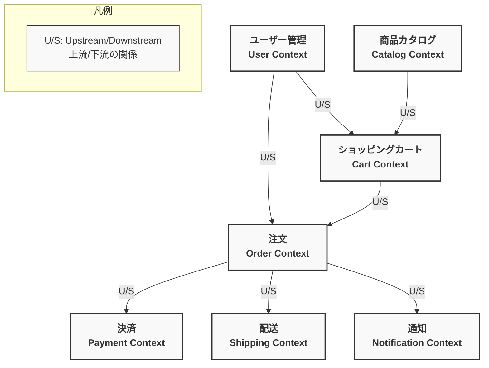

# ペットショップECサイト コンテキストマップ

## バウンデッドコンテキスト図

## バウンデッドコンテキストの説明

### ユーザー管理コンテキスト (User Context)
- **責務**: ユーザー登録、認証、ユーザー情報管理
- **主要エンティティ**: User
- **主要ユースケース**: ログイン、ユーザー登録、ユーザー情報取得
- **上流コンテキスト**: なし
- **下流コンテキスト**: ショッピングカート、注文

### 商品カタログコンテキスト (Catalog Context)
- **責務**: 商品情報の管理、検索、表示
- **主要エンティティ**: Item, Breed, Color
- **主要ユースケース**: 商品一覧表示、商品詳細表示、商品検索
- **上流コンテキスト**: なし
- **下流コンテキスト**: ショッピングカート

### ショッピングカートコンテキスト (Cart Context)
- **責務**: カート内商品の管理
- **主要エンティティ**: Order(PENDING状態), OrderItem, Option
- **主要ユースケース**: カート表示、商品追加、商品削除
- **上流コンテキスト**: ユーザー管理、商品カタログ
- **下流コンテキスト**: 注文

### 注文コンテキスト (Order Context)
- **責務**: 注文処理、注文状態管理
- **主要エンティティ**: Order, OrderStatus
- **主要ユースケース**: 注文確認、注文確定
- **上流コンテキスト**: ユーザー管理、ショッピングカート
- **下流コンテキスト**: 決済、配送、通知

### 決済コンテキスト (Payment Context)
- **責務**: 支払い処理
- **主要エンティティ**: PaymentInfo
- **主要ユースケース**: クレジットカード決済
- **上流コンテキスト**: 注文
- **下流コンテキスト**: なし

### 配送コンテキスト (Shipping Context)
- **責務**: 配送情報管理
- **主要エンティティ**: DeliveryTimeRange, TimeRange
- **主要ユースケース**: 配送日時設定
- **上流コンテキスト**: 注文
- **下流コンテキスト**: なし

### 通知コンテキスト (Notification Context)
- **責務**: メール送信などの通知
- **主要エンティティ**: なし（サービス中心）
- **主要ユースケース**: 注文確認メール送信
- **上流コンテキスト**: 注文
- **下流コンテキスト**: なし

## コンテキスト間の関係性

### Upstream/Downstream (U/S) 関係
- 上流コンテキスト（Upstream）は下流コンテキスト（Downstream）に影響を与えます
- 下流コンテキストは上流コンテキストの変更に適応する必要があります
- 例: ユーザー管理コンテキストはショッピングカートコンテキストの上流です。ユーザーモデルが変更された場合、ショッピングカートコンテキストはそれに適応する必要があります。

## Go言語実装における考慮事項

### ドメイン駆動設計（DDD）の適用
- 各バウンデッドコンテキストは独自のドメインモデルを持ちます
- コンテキスト間の連携はインターフェースを通じて行います
- 共有カーネル（Shared Kernel）は最小限に抑えます

### 関数型プログラミングの適用
- 不変性（Immutability）を重視したデータ構造
- 副作用を最小限に抑えた純粋関数の活用
- Option/Either パターンによるエラー処理
- 関数合成によるビジネスロジックの構築

### マイクロサービスへの移行可能性
- 各バウンデッドコンテキストは将来的に独立したマイクロサービスとして分離できるよう設計
- コンテキスト間の明確な境界と責任分担
- API Gateway パターンの検討
