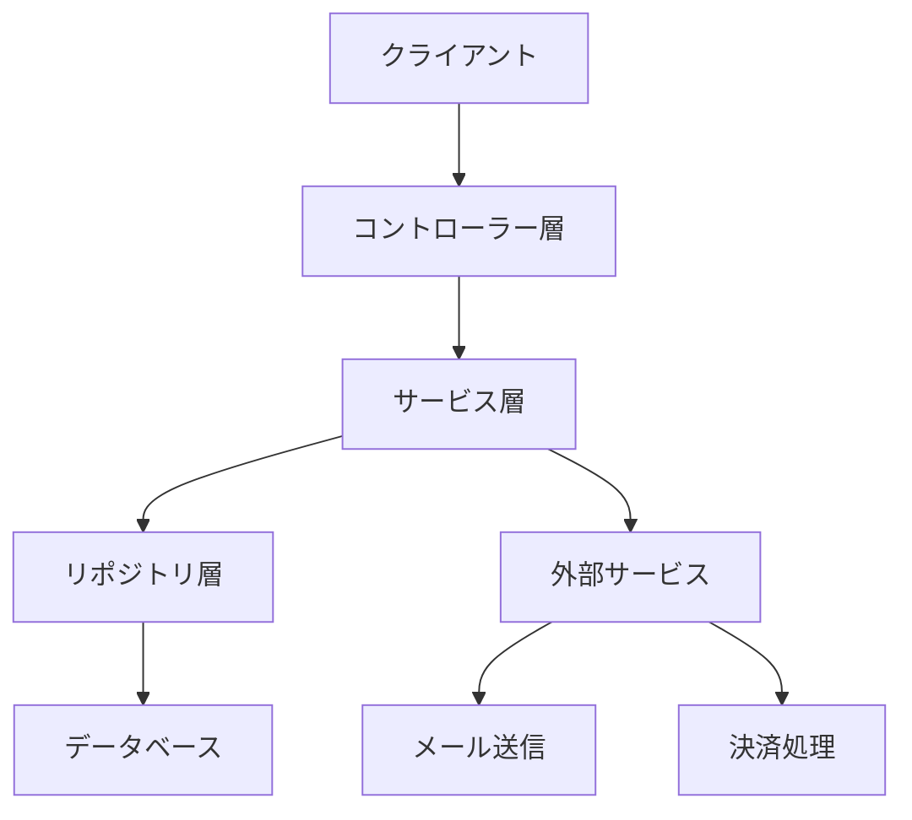
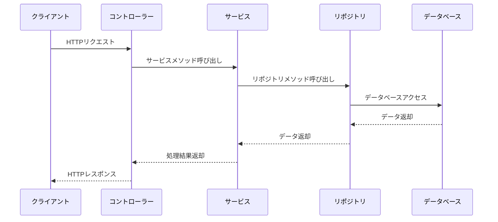
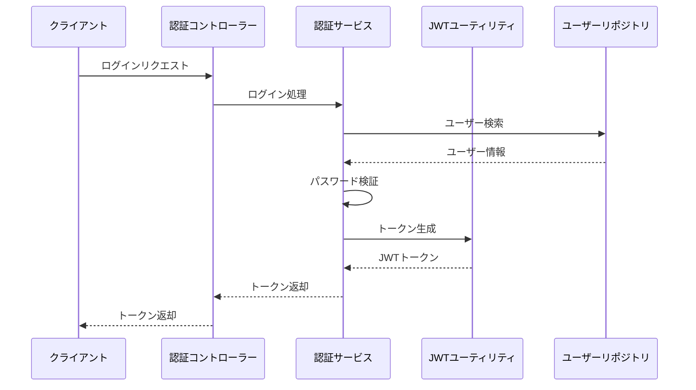

# システム概要

## プロジェクト概要

このプロジェクトは、ペットショップのECサイトを実装したSpring Bootアプリケーションです。ユーザーは犬の購入とそれに関連するオプション（エサ、おもちゃなど）を選択して注文することができます。

## 主要機能

- ユーザー登録・認証
- 商品一覧表示・検索
- 商品詳細表示
- ショッピングカート管理
- 注文処理
- 決済処理
- メール送信

## 技術スタック

- **言語**: Java 17
- **フレームワーク**: Spring Boot 3.3.0
- **データベース**: PostgreSQL
- **ORM**: Spring Data JPA
- **認証**: JWT (JSON Web Token)
- **ビルドツール**: Gradle

## システムアーキテクチャ



## レイヤー構成

- **コントローラー層**: HTTPリクエストを受け付け、レスポンスを返す
- **サービス層**: ビジネスロジックを実装
- **リポジトリ層**: データアクセスを担当
- **ドメイン層**: ビジネスエンティティを定義
- **DTO層**: データ転送オブジェクトを定義
- **セキュリティ層**: 認証・認可を担当
- **設定層**: アプリケーション設定を担当

## 主要コンポーネント

### コントローラー

- AuthenticationController: 認証処理
- CreateUserController: ユーザー登録
- ShowItemListController: 商品一覧表示
- ShowItemDetailController: 商品詳細表示
- ShoppingCartController: ショッピングカート管理
- OrderConfirmationController: 注文確認
- FinalizeOrderController: 注文確定
- UserInfoController: ユーザー情報管理

### サービス

- AuthenticationService: 認証サービス
- CreateUserService: ユーザー登録サービス
- ShowItemListService: 商品一覧表示サービス
- ShowItemDetailService: 商品詳細表示サービス
- ShoppingCartService: ショッピングカート管理サービス
- OrderConfirmationService: 注文確認サービス
- FinalizeOrderService: 注文確定サービス
- CreditCardService: クレジットカード決済サービス
- MailService: メール送信サービス
- AsyncMail: 非同期メール送信
- ImageService: 画像管理サービス
- UserInfoService: ユーザー情報管理サービス

### ドメインモデル

- User: ユーザー情報
- Item: 商品情報
- Breed: 犬種
- Color: 色
- Option: オプション
- OptionGroup: オプショングループ
- Order: 注文
- OrderItem: 注文商品
- OrderStatus: 注文ステータス
- DeliveryTimeRange: 配送時間帯
- TimeRange: 時間帯

### リポジトリ

- UserRepository: ユーザーリポジトリ
- ItemRepository: 商品リポジトリ
- BreedRepository: 犬種リポジトリ
- ColorRepository: 色リポジトリ
- OptionRepository: オプションリポジトリ
- OptionGroupRepository: オプショングループリポジトリ
- OrderRepository: 注文リポジトリ
- OrderItemRepository: 注文商品リポジトリ

## データフロー



## 認証フロー



## 注文処理フロー

```mermaid
sequenceDiagram
    participant Client as クライアント
    participant Cart as カートコントローラー
    participant Order as 注文コントローラー
    participant Service as 注文サービス
    participant Payment as 決済サービス
    participant Mail as メールサービス
    participant DB as データベース
    
    Client->>Cart: カートに商品追加
    Cart-->>Client: カート更新
    Client->>Order: 注文確認
    Order-->>Client: 注文情報表示
    Client->>Order: 注文確定
    Order->>Service: 注文処理
    Service->>Payment: 決済処理
    Payment-->>Service: 決済結果
    Service->>DB: 注文保存
    Service->>Mail: 注文確認メール送信
    Mail-->>Client: メール送信
    Service-->>Order: 処理結果
    Order-->>Client: 注文完了
