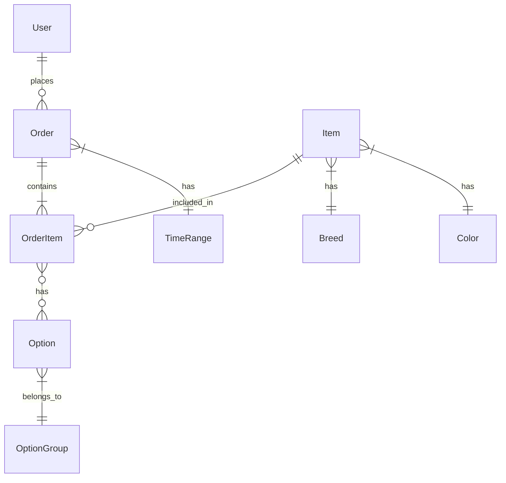

# データモデル設計

## エンティティ関連図



## 主要エンティティ

### User（ユーザー）
- id: UUID（主キー）
- firstName: String（名前）
- lastName: String（苗字）
- email: String（メールアドレス）
- password: String（パスワード）
- zipcode: String（郵便番号）
- prefecture: String（都道府県）
- municipalities: String（市区町村）
- address: String（住所）
- telephone: String（電話番号）
- createdAt: Instant（作成日時）
- updatedAt: Instant（更新日時）

### Item（商品）
- id: UUID（主キー）
- description: String（説明）
- price: Integer（価格）
- image: String（画像パス）
- gender: String（性別）
- birthDay: LocalDate（誕生日）
- deleted: boolean（削除フラグ）
- breed: Breed（犬種、外部キー）
- color: Color（色、外部キー）
- createdAt: Instant（作成日時）
- updatedAt: Instant（更新日時）

### Breed（犬種）
- id: UUID（主キー）
- name: String（犬種名）

### Color（色）
- id: UUID（主キー）
- name: String（色名）

### Order（注文）
- id: UUID（主キー）
- userId: UUID（ユーザーID、外部キー）
- status: OrderStatus（注文ステータス）
- totalPrice: Integer（合計金額）
- orderDate: LocalDate（注文日）
- destinationName: String（配送先名前）
- destinationEmail: String（配送先メールアドレス）
- destinationZipcode: String（配送先郵便番号）
- destinationPrefecture: String（配送先都道府県）
- destinationMunicipalities: String（配送先市区町村）
- destinationAddress: String（配送先住所）
- destinationTel: String（配送先電話番号）
- deliveryDate: LocalDate（配送日）
- timeRange: TimeRange（配送時間帯）
- paymentMethod: String（支払い方法）
- createdAt: Instant（作成日時）
- updatedAt: Instant（更新日時）

### OrderItem（注文商品）
- id: UUID（主キー）
- item: Item（商品、外部キー）
- order: Order（注文、外部キー）
- options: List<Option>（オプションリスト）
- createdAt: Instant（作成日時）
- updatedAt: Instant（更新日時）

### Option（オプション）
- id: UUID（主キー）
- name: String（オプション名）
- price: Integer（価格）
- optionGroup: OptionGroup（オプショングループ、外部キー）
- createdAt: Instant（作成日時）
- updatedAt: Instant（更新日時）

### OptionGroup（オプショングループ）
- id: UUID（主キー）
- name: String（グループ名）
- inputType: String（入力タイプ）
- options: List<Option>（オプションリスト）
- createdAt: Instant（作成日時）
- updatedAt: Instant（更新日時）

### OrderStatus（注文ステータス）
- 列挙型
- PENDING（保留中）
- PROCESSING（処理中）
- SHIPPED（発送済み）
- DELIVERED（配達済み）
- CANCELLED（キャンセル）

### TimeRange（配送時間帯）
- 列挙型
- MORNING（午前）
- AFTERNOON（午後）
- EVENING（夕方）

## データベーススキーマ

```sql
-- UUID
CREATE EXTENSION IF NOT EXISTS "uuid-ossp";

-- ユーザー(users)
CREATE TABLE users (
  id UUID PRIMARY KEY DEFAULT uuid_generate_v4()
 , first_name text not null
 , last_name text not null
 , email text not null unique
 , password text not null
 , zipcode text not null
 , prefecture text not null
 , municipalities text not null
 , address text not null
 , telephone text not null
 , created_at timestamp default CURRENT_TIMESTAMP
 , updated_at timestamp default CURRENT_TIMESTAMP
);

-- 配達時間(delivery_time_ranges)
CREATE TABLE delivery_time_ranges(
    id UUID PRIMARY KEY DEFAULT uuid_generate_v4()
    , time_range text not null
);

-- 犬種(breeds)
CREATE TABLE breeds (
    id UUID PRIMARY KEY DEFAULT uuid_generate_v4(),
    name text not null
);

-- 色(colors)
CREATE TABLE colors (
    id UUID PRIMARY KEY DEFAULT uuid_generate_v4(),
    name text not null
);

-- 商品(items)
CREATE TABLE items (
  id UUID PRIMARY KEY DEFAULT uuid_generate_v4()
  , description text not null
  , price integer not null
  , image text not null
  , gender text not null
  , birth_day DATE not null
  , deleted boolean default false not null
  , breed_id UUID
  , color_id UUID
  , created_at timestamp default CURRENT_TIMESTAMP
  , updated_at timestamp default CURRENT_TIMESTAMP
  , FOREIGN KEY (breed_id) REFERENCES breeds(id)
  , FOREIGN KEY (color_id) REFERENCES colors(id)
);

-- オプショングループ(option_groups)
CREATE TABLE option_groups (
    id UUID PRIMARY KEY DEFAULT uuid_generate_v4(),
    name text not null,
    input_type text not null
);

-- オプション(options)
CREATE TABLE options (
    id UUID PRIMARY KEY DEFAULT uuid_generate_v4(),
    name text not null,
    price Integer not null,
    option_group_id UUID,
    FOREIGN KEY (option_group_id) REFERENCES option_groups(id)
);

-- 注文(orders)
CREATE TABLE orders (
  id UUID PRIMARY KEY DEFAULT uuid_generate_v4(),
  user_id UUID,
  status INTEGER not null,
  total_price INTEGER not null,
  order_date text not null,
  destination_name text default '',
  destination_email text not null,
  destination_zipcode text not null,
  destination_prefecture text not null,
  destination_municipalities text not null,
  destination_address text not null,
  destination_tel text not null,
  delivery_date DATE not null,
  delivery_time UUID not null,
  payment_method text not null,
  created_at timestamp default CURRENT_TIMESTAMP,
  updated_at timestamp default CURRENT_TIMESTAMP,
  FOREIGN KEY (delivery_time) REFERENCES delivery_time_ranges(id)
);

-- 注文された商品(order_items)
CREATE TABLE order_items (
    id UUID PRIMARY KEY DEFAULT uuid_generate_v4(),
    item_id UUID,
    order_id UUID,
    FOREIGN KEY (item_id) REFERENCES items(id),
    FOREIGN KEY (order_id) REFERENCES orders(id)
);

-- 注文された商品のオプション(order_item_options)
CREATE TABLE order_item_options(
    id UUID PRIMARY KEY DEFAULT uuid_generate_v4(),
    order_item_id UUID,
    option_id UUID,
    FOREIGN KEY (order_item_id) REFERENCES order_items(id),
    FOREIGN KEY (option_id) REFERENCES options(id)
);
```

## データモデルの特徴

1. **UUID主キー**: すべてのエンティティはUUIDを主キーとして使用しています。
2. **監査情報**: 多くのエンティティは作成日時と更新日時を持っています。
3. **論理削除**: 商品（Item）は物理削除ではなく論理削除（deletedフラグ）を使用しています。
4. **多対多関連**: OrderItemとOptionの間には多対多の関連があります。
5. **列挙型**: OrderStatusやTimeRangeなど、列挙型を使用して定数値を管理しています。

## JPA関連

- Spring Data JPAを使用してORマッピングを実装しています。
- @Entityアノテーションでエンティティクラスを定義しています。
- @ManyToOne、@OneToMany、@ManyToManyなどのアノテーションでエンティティ間の関連を定義しています。
- @CreatedDateと@LastModifiedDateアノテーションで監査情報を自動的に設定しています。
- @Builderアノテーションでビルダーパターンを実装しています。
