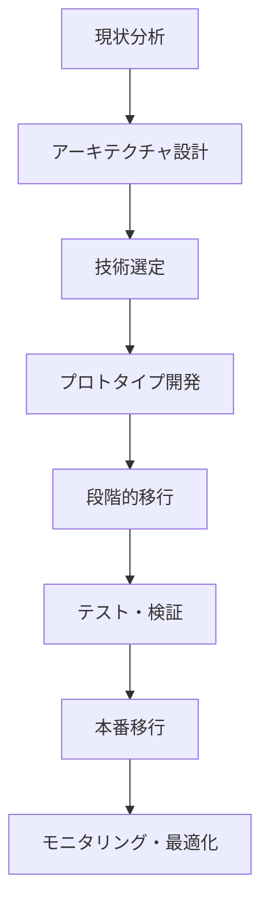
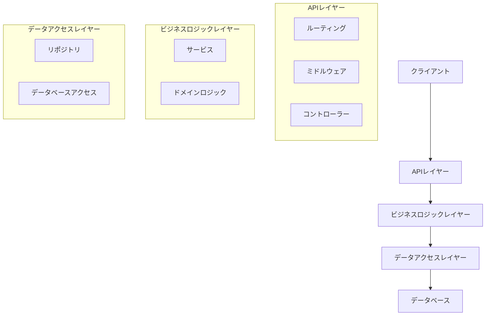
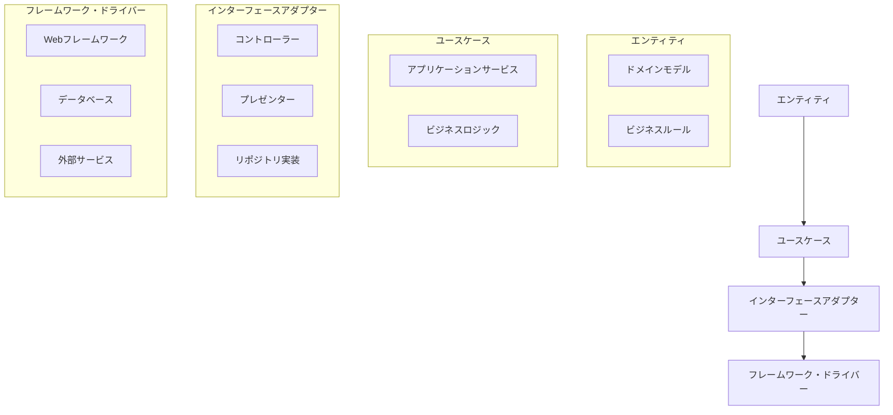
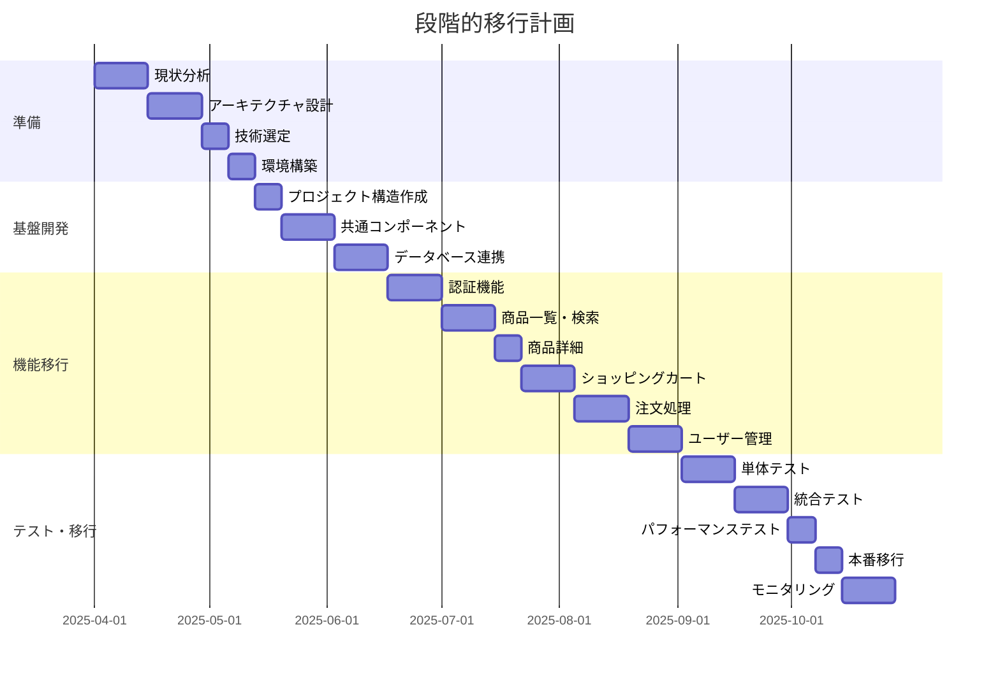
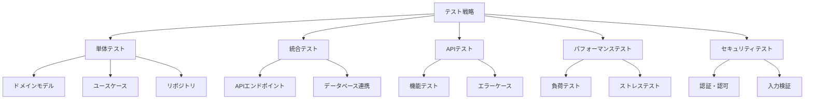

# Go言語移行計画

## 移行の目的

現在のJava/Spring Bootで実装されたペットショップECサイトをGo言語に移行する目的は以下の通りです：

1. **パフォーマンスの向上**: Goの軽量な実行モデルによる高速なレスポンスタイムの実現
2. **リソース効率の改善**: メモリ使用量の削減とスケーラビリティの向上
3. **開発・デプロイの簡素化**: シンプルな言語仕様と単一バイナリによるデプロイの容易さ
4. **並行処理の強化**: Goの強力な並行処理モデルを活用した効率的な処理

## 移行アプローチ



### 1. 現状分析

- 現行システムの機能一覧の作成
- データモデルの分析
- API仕様の整理
- 依存関係の把握
- パフォーマンスのベンチマーク測定

### 2. アーキテクチャ設計



#### クリーンアーキテクチャの採用



### 3. 技術選定

#### Webフレームワーク

| フレームワーク | 特徴 | 採用理由 |
|--------------|------|---------|
| Gin | 高速、ミドルウェアサポート、シンプル | パフォーマンスが高く、使いやすい |
| Echo | 高速、拡張性、ミドルウェアサポート | 構造化されたAPIと拡張性 |
| Chi | 軽量、標準ライブラリベース | 標準ライブラリとの互換性 |

**推奨**: Gin または Echo

#### データベースアクセス

| ライブラリ | 特徴 | 採用理由 |
|-----------|------|---------|
| GORM | ORMマッピング、マイグレーション | Javaの JPA に近い使用感 |
| sqlx | 軽量、型安全なクエリ | パフォーマンスが高く、シンプル |
| pgx | PostgreSQL特化、高機能 | PostgreSQLの機能を最大限活用 |

**推奨**: GORM（開発効率）または sqlx（パフォーマンス重視）

#### 認証

| ライブラリ | 特徴 | 採用理由 |
|-----------|------|---------|
| jwt-go | JWT実装、柔軟性 | 現行システムと同様のJWT認証 |
| casbin | 柔軟な認可モデル | 複雑な認可ルールに対応 |

**推奨**: jwt-go + casbin

#### バリデーション

| ライブラリ | 特徴 | 採用理由 |
|-----------|------|---------|
| validator | タグベースのバリデーション | 使いやすく、機能が豊富 |
| ozzo-validation | コードベースのバリデーション | 複雑なバリデーションに対応 |

**推奨**: validator

#### 設定管理

| ライブラリ | 特徴 | 採用理由 |
|-----------|------|---------|
| viper | 多様な設定ソース、環境変数 | 柔軟な設定管理 |
| godotenv | .env ファイルサポート | シンプルで使いやすい |

**推奨**: viper

#### ロギング

| ライブラリ | 特徴 | 採用理由 |
|-----------|------|---------|
| zap | 高性能、構造化ロギング | パフォーマンスが高い |
| logrus | 柔軟、拡張性 | 使いやすく、機能が豊富 |

**推奨**: zap

### 4. プロジェクト構造

```
.
├── cmd/
│   └── server/
│       └── main.go           # エントリーポイント
├── internal/
│   ├── api/
│   │   ├── handler/          # HTTPハンドラー
│   │   ├── middleware/       # HTTPミドルウェア
│   │   └── router.go         # ルーティング設定
│   ├── config/
│   │   └── config.go         # 設定管理
│   ├── domain/
│   │   ├── model/            # ドメインモデル
│   │   └── service/          # ドメインサービス
│   ├── dto/
│   │   └── request/          # リクエストDTO
│   │   └── response/         # レスポンスDTO
│   ├── repository/
│   │   ├── postgres/         # PostgreSQL実装
│   │   └── interface.go      # リポジトリインターフェース
│   └── usecase/
│       └── service/          # アプリケーションサービス
├── pkg/
│   ├── auth/                 # 認証ユーティリティ
│   ├── logger/               # ロギングユーティリティ
│   └── validator/            # バリデーションユーティリティ
├── migrations/
│   └── *.sql                 # データベースマイグレーション
├── scripts/
│   └── *.sh                  # ユーティリティスクリプト
├── .env.example              # 環境変数サンプル
├── .gitignore
├── Dockerfile
├── docker-compose.yml
├── go.mod
├── go.sum
└── README.md
```

### 5. 段階的移行計画



#### フェーズ1: 基盤構築（4週間）

1. プロジェクト構造の作成
2. 共通コンポーネントの実装
   - 設定管理
   - ロギング
   - エラーハンドリング
   - データベース接続
3. 認証基盤の実装
   - JWTトークン生成・検証
   - ミドルウェア

#### フェーズ2: コア機能実装（8週間）

1. ドメインモデルの実装
2. リポジトリレイヤーの実装
3. 基本的なAPIエンドポイントの実装
   - 商品一覧・検索
   - 商品詳細
   - ユーザー登録・認証

#### フェーズ3: 応用機能実装（8週間）

1. ショッピングカート機能
2. 注文処理機能
3. 決済連携
4. メール送信

#### フェーズ4: テスト・最適化（4週間）

1. 単体テスト
2. 統合テスト
3. パフォーマンステスト
4. セキュリティテスト

#### フェーズ5: 移行・運用（4週間）

1. 段階的デプロイ
2. モニタリング設定
3. パフォーマンス最適化
4. ドキュメント整備

### 6. データ移行計画

1. **スキーマ移行**: 既存のデータベーススキーマをGoのマイグレーションツールで再作成
2. **データ移行**: 本番データのエクスポート・インポート
3. **整合性検証**: データの整合性チェック

### 7. テスト戦略



#### 単体テスト

- テストフレームワーク: Go標準の `testing` パッケージ
- モックライブラリ: `gomock` または `testify/mock`
- カバレッジ目標: 80%以上

#### 統合テスト

- HTTPテスト: `net/http/httptest`
- データベーステスト: テスト用データベース
- カバレッジ目標: 70%以上

#### APIテスト

- ツール: Postman, REST Assured
- 自動化: CI/CDパイプライン

#### パフォーマンステスト

- ツール: Apache JMeter, k6
- 指標: レスポンスタイム、スループット、リソース使用量

### 8. リスクと対策

| リスク | 影響度 | 発生確率 | 対策 |
|-------|-------|---------|-----|
| 機能の欠落 | 高 | 中 | 詳細な機能一覧の作成と検証 |
| パフォーマンス低下 | 高 | 低 | 継続的なベンチマークテスト |
| データ整合性の問題 | 高 | 中 | 厳格なデータ移行テスト |
| チームのGo言語習熟度 | 中 | 高 | トレーニングとペアプログラミング |
| 移行期間の長期化 | 中 | 中 | 段階的移行と明確なマイルストーン |
| セキュリティの脆弱性 | 高 | 低 | セキュリティレビューと自動化テスト |

### 9. 成功基準

1. **機能的同等性**: 全ての既存機能が正常に動作すること
2. **パフォーマンス向上**: レスポンスタイムが現行システムより20%以上改善
3. **リソース効率**: メモリ使用量が30%以上削減
4. **コード品質**: テストカバレッジ80%以上、静的解析エラーなし
5. **運用効率**: デプロイ時間の短縮、監視の容易さ

### 10. 移行後の評価

1. **パフォーマンス指標の比較**
   - レスポンスタイム
   - スループット
   - リソース使用量
2. **開発効率の評価**
   - コード行数
   - 開発サイクル時間
   - バグ発生率
3. **運用効率の評価**
   - デプロイ頻度
   - 障害復旧時間
   - 監視の容易さ

## Go言語実装のサンプルコード

### 1. メインエントリーポイント

```go
// cmd/server/main.go
package main

import (
	"log"

	"github.com/example/petshop/internal/api"
	"github.com/example/petshop/internal/config"
	"github.com/example/petshop/internal/repository/postgres"
	"github.com/example/petshop/pkg/logger"
)

func main() {
	// 設定の読み込み
	cfg, err := config.Load()
	if err != nil {
		log.Fatalf("Failed to load config: %v", err)
	}

	// ロガーの初期化
	l := logger.New(cfg.LogLevel)

	// データベース接続
	db, err := postgres.NewConnection(cfg.Database)
	if err != nil {
		l.Fatal("Failed to connect to database", err)
	}
	defer db.Close()

	// リポジトリの初期化
	repos := postgres.NewRepositories(db)

	// サーバーの起動
	server := api.NewServer(cfg, l, repos)
	if err := server.Start(); err != nil {
		l.Fatal("Failed to start server", err)
	}
}
```

### 2. ドメインモデル

```go
// internal/domain/model/user.go
package model

import (
	"time"

	"github.com/google/uuid"
)

type User struct {
	ID            uuid.UUID `json:"id"`
	FirstName     string    `json:"firstName"`
	LastName      string    `json:"lastName"`
	Email         string    `json:"email"`
	Password      string    `json:"-"` // パスワードはJSONに含めない
	Zipcode       string    `json:"zipcode"`
	Prefecture    string    `json:"prefecture"`
	Municipalities string    `json:"municipalities"`
	Address       string    `json:"address"`
	Telephone     string    `json:"telephone"`
	CreatedAt     time.Time `json:"createdAt"`
	UpdatedAt     time.Time `json:"updatedAt"`
}

// NewUser creates a new user with a generated UUID
func NewUser(firstName, lastName, email, password, zipcode, prefecture, municipalities, address, telephone string) *User {
	now := time.Now()
	return &User{
		ID:            uuid.New(),
		FirstName:     firstName,
		LastName:      lastName,
		Email:         email,
		Password:      password, // 注: 実際の実装ではハッシュ化する
		Zipcode:       zipcode,
		Prefecture:    prefecture,
		Municipalities: municipalities,
		Address:       address,
		Telephone:     telephone,
		CreatedAt:     now,
		UpdatedAt:     now,
	}
}
```

### 3. リポジトリインターフェース

```go
// internal/repository/interface.go
package repository

import (
	"context"

	"github.com/example/petshop/internal/domain/model"
	"github.com/google/uuid"
)

type UserRepository interface {
	Create(ctx context.Context, user *model.User) error
	FindByID(ctx context.Context, id uuid.UUID) (*model.User, error)
	FindByEmail(ctx context.Context, email string) (*model.User, error)
	Update(ctx context.Context, user *model.User) error
	Delete(ctx context.Context, id uuid.UUID) error
}

type ItemRepository interface {
	FindAll(ctx context.Context) ([]*model.Item, error)
	FindByID(ctx context.Context, id uuid.UUID) (*model.Item, error)
	Search(ctx context.Context, criteria *model.SearchCriteria) ([]*model.Item, error)
	Create(ctx context.Context, item *model.Item) error
	Update(ctx context.Context, item *model.Item) error
	Delete(ctx context.Context, id uuid.UUID) error
}

type OrderRepository interface {
	FindByID(ctx context.Context, id uuid.UUID) (*model.Order, error)
	FindByUserID(ctx context.Context, userID uuid.UUID) ([]*model.Order, error)
	FindByUserIDAndStatus(ctx context.Context, userID uuid.UUID, status model.OrderStatus) (*model.Order, error)
	Create(ctx context.Context, order *model.Order) error
	Update(ctx context.Context, order *model.Order) error
}

type Repositories interface {
	Users() UserRepository
	Items() ItemRepository
	Orders() OrderRepository
	// 他のリポジトリ...
}
```

### 4. ユースケース（サービス）

```go
// internal/usecase/service/authentication_service.go
package service

import (
	"context"
	"errors"
	"time"

	"github.com/example/petshop/internal/domain/model"
	"github.com/example/petshop/internal/dto/request"
	"github.com/example/petshop/internal/dto/response"
	"github.com/example/petshop/internal/repository"
	"github.com/example/petshop/pkg/auth"
	"github.com/example/petshop/pkg/logger"
	"golang.org/x/crypto/bcrypt"
)

type AuthenticationService struct {
	userRepo repository.UserRepository
	jwtUtil  *auth.JWTUtil
	logger   *logger.Logger
}

func NewAuthenticationService(userRepo repository.UserRepository, jwtUtil *auth.JWTUtil, logger *logger.Logger) *AuthenticationService {
	return &AuthenticationService{
		userRepo: userRepo,
		jwtUtil:  jwtUtil,
		logger:   logger,
	}
}

func (s *AuthenticationService) Login(ctx context.Context, req *request.LoginRequest) (*response.LoginResponse, error) {
	user, err := s.userRepo.FindByEmail(ctx, req.Email)
	if err != nil {
		s.logger.Error("Failed to find user by email", err)
		return nil, errors.New("invalid credentials")
	}

	if user == nil {
		return nil, errors.New("invalid credentials")
	}

	// パスワードの検証
	if err := bcrypt.CompareHashAndPassword([]byte(user.Password), []byte(req.Password)); err != nil {
		s.logger.Error("Password mismatch", err)
		return nil, errors.New("invalid credentials")
	}

	// JWTトークンの生成
	token, err := s.jwtUtil.GenerateToken(user.ID.String(), user.LastName+" "+user.FirstName)
	if err != nil {
		s.logger.Error("Failed to generate token", err)
		return nil, errors.New("authentication failed")
	}

	return &response.LoginResponse{
		Token: token,
		User: response.UserResponse{
			ID:        user.ID,
			FirstName: user.FirstName,
			LastName:  user.LastName,
			Email:     user.Email,
		},
	}, nil
}
```

### 5. APIハンドラー

```go
// internal/api/handler/authentication_handler.go
package handler

import (
	"net/http"

	"github.com/example/petshop/internal/dto/request"
	"github.com/example/petshop/internal/usecase/service"
	"github.com/example/petshop/pkg/logger"
	"github.com/gin-gonic/gin"
)

type AuthenticationHandler struct {
	authService *service.AuthenticationService
	logger      *logger.Logger
}

func NewAuthenticationHandler(authService *service.AuthenticationService, logger *logger.Logger) *AuthenticationHandler {
	return &AuthenticationHandler{
		authService: authService,
		logger:      logger,
	}
}

func (h *AuthenticationHandler) Login(c *gin.Context) {
	var req request.LoginRequest
	if err := c.ShouldBindJSON(&req); err != nil {
		h.logger.Error("Invalid request body", err)
		c.JSON(http.StatusBadRequest, gin.H{"error": "Invalid request"})
		return
	}

	resp, err := h.authService.Login(c.Request.Context(), &req)
	if err != nil {
		h.logger.Error("Login failed", err)
		c.JSON(http.StatusUnauthorized, gin.H{"error": "Invalid credentials"})
		return
	}

	c.JSON(http.StatusOK, resp)
}

func (h *AuthenticationHandler) Register(c *gin.Context) {
	// 実装省略
}
```

### 6. ルーティング

```go
// internal/api/router.go
package api

import (
	"github.com/example/petshop/internal/api/handler"
	"github.com/example/petshop/internal/api/middleware"
	"github.com/gin-gonic/gin"
)

func SetupRouter(
	authHandler *handler.AuthenticationHandler,
	itemHandler *handler.ItemHandler,
	cartHandler *handler.ShoppingCartHandler,
	orderHandler *handler.OrderHandler,
	userHandler *handler.UserHandler,
	authMiddleware *middleware.AuthMiddleware,
) *gin.Engine {
	r := gin.Default()

	// ミドルウェアの設定
	r.Use(middleware.CORS())
	r.Use(middleware.RequestLogger())

	// 認証API
	auth := r.Group("/api/authentication")
	{
		auth.POST("/login", authHandler.Login)
	}

	// ユーザー登録API
	r.POST("/api/register", authHandler.Register)

	// 商品API
	items := r.Group("/api/getItemList")
	{
		items.GET("", itemHandler.GetAll)
		items.POST("/search", itemHandler.Search)
		items.POST("/page", itemHandler.GetPage)
	}

	// 商品詳細API
	r.GET("/showDetail", itemHandler.GetDetail)

	// ショッピングカートAPI
	cart := r.Group("/api/shoppingCart")
	{
		cart.POST("/getShoppingCart", cartHandler.GetShoppingCart)
		cart.POST("/addItem", cartHandler.AddItem)
		cart.POST("/deleteItem", cartHandler.DeleteItem)
	}

	// 注文API
	confirm := r.Group("/api/confirm")
	confirm.Use(authMiddleware.RequireAuth())
	{
		confirm.POST("/finalize", orderHandler.Finalize)
	}

	// ユーザー情報API
	r.GET("/api/getUser", authMiddleware.RequireAuth(), userHandler.GetUserInfo)

	// 画像API
	r.GET("/img/:name", itemHandler.GetImage)

	return r
}
```

### 7. ミドルウェア

```go
// internal/api/middleware/auth_middleware.go
package middleware

import (
	"net/http"
	"strings"

	"github.com/example/petshop/pkg/auth"
	"github.com/example/petshop/pkg/logger"
	"github.com/gin-gonic/gin"
)

type AuthMiddleware struct {
	jwtUtil *auth.JWTUtil
	logger  *logger.Logger
}

func NewAuthMiddleware(jwtUtil *auth.JWTUtil, logger *logger.Logger) *AuthMiddleware {
	return &AuthMiddleware{
		jwtUtil: jwtUtil,
		logger:  logger,
	}
}

func (m *AuthMiddleware) RequireAuth() gin.HandlerFunc {
	return func(c *gin.Context) {
		authHeader := c.GetHeader("Authorization")
		if authHeader == "" {
			m.logger.Warn("Missing Authorization header")
			c.JSON(http.StatusUnauthorized, gin.H{"error": "Authorization required"})
			c.Abort()
			return
		}

		// Bearer トークンの抽出
		parts := strings.Split(authHeader, " ")
		if len(parts) != 2 || parts[0] != "Bearer" {
			m.logger.Warn("Invalid Authorization header format")
			c.JSON(http.StatusUnauthorized, gin.H{"error": "Invalid authorization format"})
			c.Abort()
			return
		}

		token := parts[1]
		claims, err := m.jwtUtil.ValidateToken(token)
		if err != nil {
			m.logger.Error("Invalid token", err)
			c.JSON(http.StatusUnauthorized, gin.H{"error": "Invalid token"})
			c.Abort()
			return
		}

		// 認証情報をコンテキストに設定
		c.Set("userID", claims.ID)
		c.Set("username", claims.Username)

		c.Next()
	}
}
```

## まとめ

Go言語への移行は、パフォーマンスの向上、リソース効率の改善、開発・デプロイの簡素化、並行処理の強化といった多くのメリットをもたらします。本計画に基づいて段階的に移行を進めることで、リスクを最小限に抑えつつ、効率的にシステムを刷新することが可能です。

移行後は、継続的なモニタリングと最適化を行い、Go言語の特性を最大限に活かしたシステム運用を目指します。
