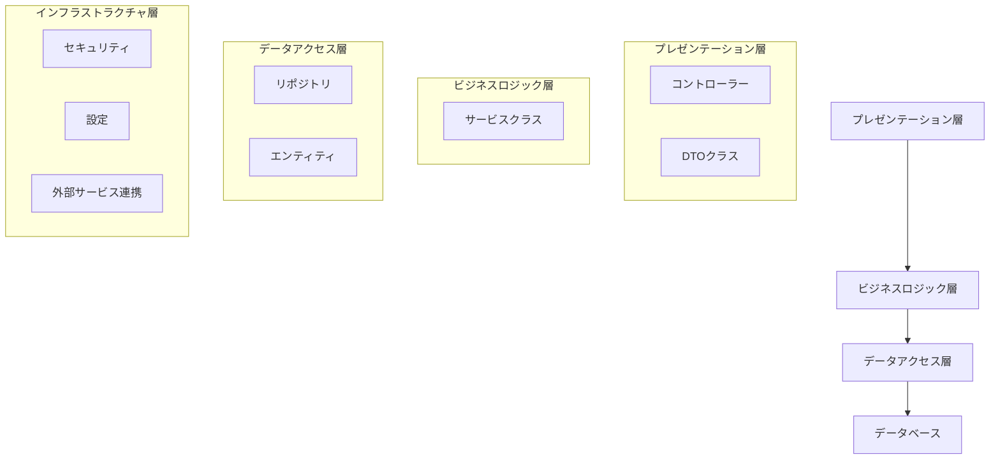
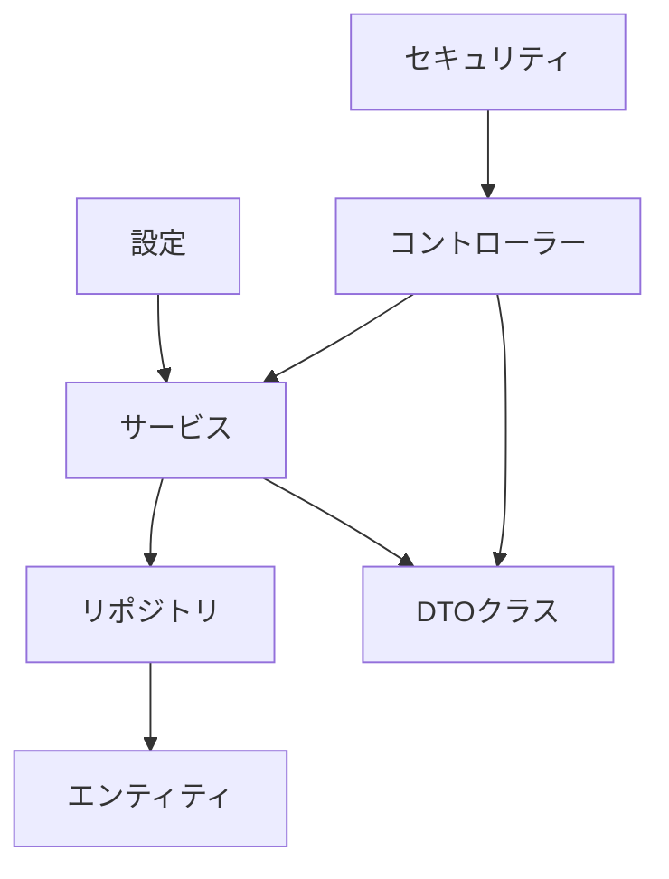
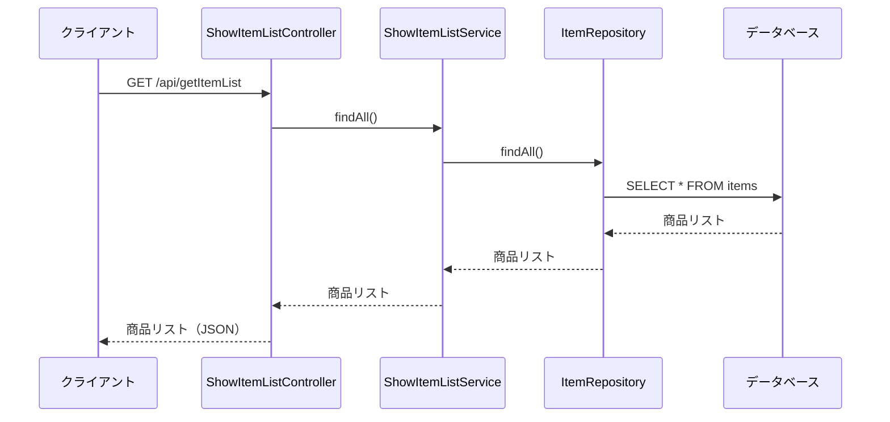
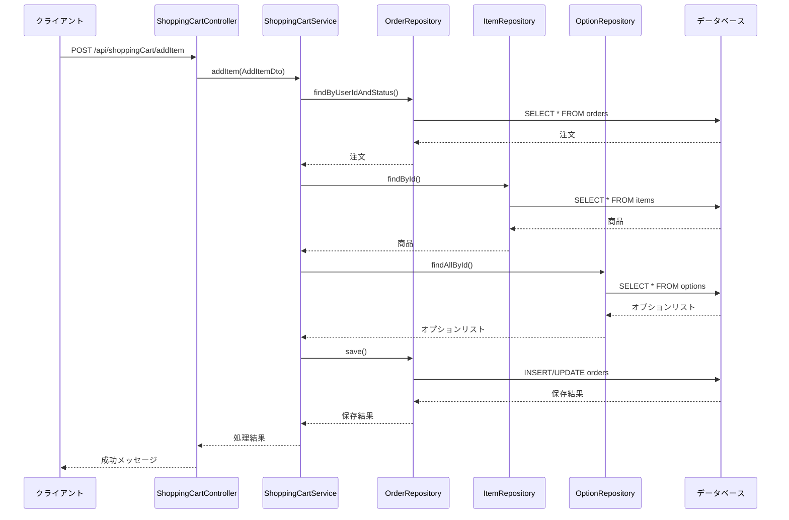
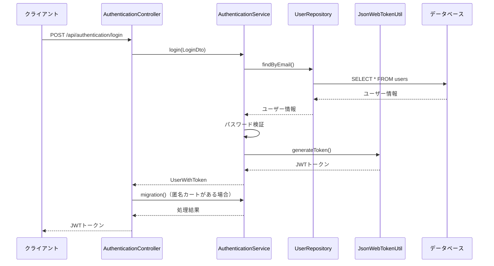
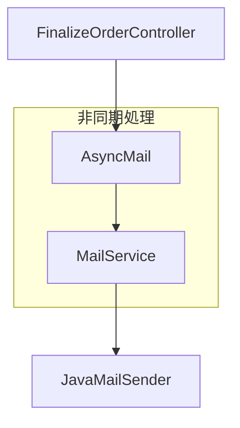
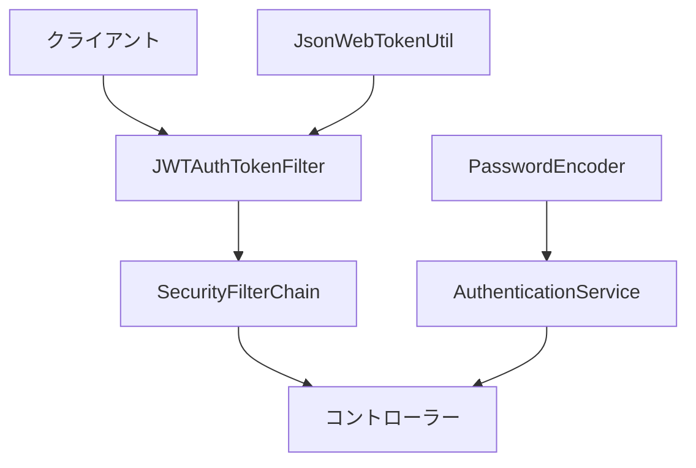

# アプリケーション構造

## レイヤーアーキテクチャ

このアプリケーションは、以下の層から構成される標準的なレイヤードアーキテクチャを採用しています。



### プレゼンテーション層

プレゼンテーション層は、クライアントからのリクエストを受け付け、適切なレスポンスを返す役割を担います。

#### コントローラー

- **AuthenticationController**: 認証処理を担当
- **CreateUserController**: ユーザー登録処理を担当
- **ShowItemListController**: 商品一覧表示処理を担当
- **ShowItemDetailController**: 商品詳細表示処理を担当
- **ShoppingCartController**: ショッピングカート操作処理を担当
- **OrderConfirmationController**: 注文確認処理を担当
- **FinalizeOrderController**: 注文確定処理を担当
- **UserInfoController**: ユーザー情報取得処理を担当
- **SourceController**: 画像ファイル取得処理を担当

#### DTOクラス

- **LoginDto**: ログイン情報を保持
- **UserRegistrationDto**: ユーザー登録情報を保持
- **SearchDto**: 商品検索条件を保持
- **PageRequestDto**: ページング情報を保持
- **PageResponseDto**: ページング結果を保持
- **AddItemDto**: カートに追加する商品情報を保持
- **DeleteItemDto**: カートから削除する商品情報を保持
- **GetShoppingCartDto**: ショッピングカート取得情報を保持
- **FinalizeOrderDto**: 注文確定情報を保持
- **PaymentInfoDTO**: 支払い情報を保持
- **UserInfo**: ユーザー情報を保持

### ビジネスロジック層

ビジネスロジック層は、アプリケーションのコアとなるビジネスロジックを実装します。

#### サービスクラス

- **AuthenticationService**: 認証ロジックを実装
- **CreateUserService**: ユーザー登録ロジックを実装
- **ShowItemListService**: 商品一覧表示ロジックを実装
- **ShowItemDetailService**: 商品詳細表示ロジックを実装
- **ShoppingCartService**: ショッピングカート操作ロジックを実装
- **OrderConfirmationService**: 注文確認ロジックを実装
- **FinalizeOrderService**: 注文確定ロジックを実装
- **CreditCardService**: クレジットカード決済ロジックを実装
- **MailService**: メール送信ロジックを実装
- **AsyncMail**: 非同期メール送信ロジックを実装
- **ImageService**: 画像管理ロジックを実装
- **UserInfoService**: ユーザー情報管理ロジックを実装

### データアクセス層

データアクセス層は、データベースとのやり取りを担当します。

#### リポジトリ

- **UserRepository**: ユーザー情報のCRUD操作を担当
- **ItemRepository**: 商品情報のCRUD操作を担当
- **BreedRepository**: 犬種情報のCRUD操作を担当
- **ColorRepository**: 色情報のCRUD操作を担当
- **OptionRepository**: オプション情報のCRUD操作を担当
- **OptionGroupRepository**: オプショングループ情報のCRUD操作を担当
- **OrderRepository**: 注文情報のCRUD操作を担当
- **OrderItemRepository**: 注文商品情報のCRUD操作を担当

#### エンティティ

- **User**: ユーザー情報を表現
- **Item**: 商品情報を表現
- **Breed**: 犬種情報を表現
- **Color**: 色情報を表現
- **Option**: オプション情報を表現
- **OptionGroup**: オプショングループ情報を表現
- **Order**: 注文情報を表現
- **OrderItem**: 注文商品情報を表現
- **OrderStatus**: 注文ステータスを表現
- **DeliveryTimeRange**: 配送時間帯を表現
- **TimeRange**: 時間帯を表現

### インフラストラクチャ層

インフラストラクチャ層は、アプリケーションの基盤となる機能を提供します。

#### セキュリティ

- **SecurityConfig**: Spring Securityの設定
- **JsonWebTokenUtil**: JWTトークンの生成・検証
- **JWTAuthenticationToken**: JWT認証トークン
- **JWTAuthTokenFilter**: JWT認証フィルター

#### 設定

- **AsyncConfig**: 非同期処理の設定
- **Config**: アプリケーション全般の設定
- **MailTask**: メール送信タスクの設定

#### 外部サービス連携

- **CreditCardService**: クレジットカード決済サービスとの連携

## パッケージ構成

```
com.example
├── configuration        # 設定クラス
├── contoroller          # コントローラークラス
├── domain               # ドメインモデル（エンティティ）
├── dtos                 # DTOクラス
├── repositories         # リポジトリインターフェース
├── repository           # リポジトリインターフェース（別パッケージ）
├── security             # セキュリティ関連クラス
└── service              # サービスクラス
```

## 主要コンポーネント間の関連



## データフロー

### 商品一覧表示



### ショッピングカートに商品追加



### ユーザー認証



## 非同期処理



## セキュリティ構成



## 例外処理

各コントローラーでは、try-catchブロックを使用して例外をキャッチし、適切なHTTPステータスコードとエラーメッセージをクライアントに返しています。

```java
try {
    // 処理
    return ResponseEntity.ok(result);
} catch (Exception e) {
    return ResponseEntity.badRequest().body(e.getMessage());
}
