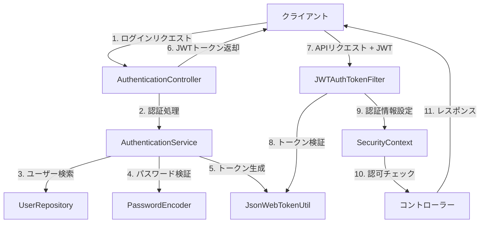

# セキュリティ設計

## 認証・認可の仕組み

このアプリケーションでは、JWT（JSON Web Token）を使用したステートレスな認証・認可の仕組みを採用しています。



### 認証フロー

1. クライアントがログインAPIにユーザー名とパスワードを送信
2. AuthenticationServiceがユーザーを検索し、パスワードを検証
3. 認証成功時、JsonWebTokenUtilがJWTトークンを生成
4. クライアントにJWTトークンを返却
5. 以降のリクエストでは、クライアントがAuthorizationヘッダーにJWTトークンを付与
6. JWTAuthTokenFilterがトークンを検証し、認証情報をSecurityContextに設定
7. Spring Securityが認可チェックを行い、アクセス制御を実施

## セキュリティ設定

### SecurityConfig

```java
@Configuration
@EnableMethodSecurity
public class SecurityConfig {

    @Bean
    public SecurityFilterChain filterChain(HttpSecurity http) throws Exception {
        http.addFilterBefore(jwtAuthTokenFilter, AuthorizationFilter.class);
        http.csrf(csrf -> csrf.disable());
        http.authorizeHttpRequests(authorize -> authorize
                .requestMatchers("/**").permitAll()
                .anyRequest().authenticated());
        http.sessionManagement(
                session -> session.sessionCreationPolicy(SessionCreationPolicy.STATELESS));

        return http.build();
    }

    @Bean
    public PasswordEncoder passwordEncoder() {
        return new BCryptPasswordEncoder();
    }

    @Autowired
    public JWTAuthTokenFilter jwtAuthTokenFilter;
}
```

### JWTAuthTokenFilter

```java
@Component
public class JWTAuthTokenFilter extends OncePerRequestFilter {

    @Autowired
    private JsonWebTokenUtil jwtUtil;

    @Override
    protected void doFilterInternal(HttpServletRequest request, HttpServletResponse response, FilterChain filterChain)
            throws ServletException, IOException {
        // リクエストからJWTトークンを取得
        // トークンを検証
        // 認証情報をSecurityContextに設定
        // フィルターチェーンを継続
    }
}
```

### JsonWebTokenUtil

```java
@Component
public class JsonWebTokenUtil {

    @Value("${jwt.secretKey}")
    private String secretKey;

    @Value("${jwt.expirationDays}")
    private long expirationDays;

    public String generateToken(String id, String username) {
        // JWTトークンを生成
    }

    public boolean validateToken(String token) {
        // トークンを検証
    }

    public String getIdFromToken(String token) {
        // トークンからIDを取得
    }

    public String getUsernameFromToken(String token) {
        // トークンからユーザー名を取得
    }
}
```

## パスワード管理

パスワードは、BCryptPasswordEncoderを使用してハッシュ化して保存しています。

```java
@Service
public class AuthenticationService {

    @Autowired
    private PasswordEncoder passwordEncoder;

    public UserWithToken login(LoginDto loginDto) {
        // パスワードの検証
        if (passwordEncoder.matches(loginDto.getPassword(), user.getPassword())) {
            // 認証成功
        }
    }
}

@Service
public class CreateUserService {

    @Autowired
    private PasswordEncoder passwordEncoder;

    public void create(UserRegistrationDto registrationDto) {
        // パスワードのハッシュ化
        String hashedPassword = passwordEncoder.encode(registrationDto.getPassword());
        // ユーザー作成
    }
}
```

## 認可制御

Spring Securityのメソッドセキュリティを使用して、特定のAPIへのアクセスを制限しています。

```java
@RestController
public class UserInfoController {

    @PreAuthorize("isAuthenticated()")
    @GetMapping("/api/getUser")
    public UserInfo getUserInfo(@AuthenticationPrincipal JWTAuthenticationToken.AuthenticationUser token) {
        // 認証済みユーザーのみアクセス可能
    }
}

@RestController
@RequestMapping("/api/confirm")
public class FinalizeOrderController {

    @PostMapping("/finalize")
    @PreAuthorize("isAuthenticated()")
    public ResponseEntity<?> finalized(@RequestBody RequestInfo requestInfo,
            @AuthenticationPrincipal AuthenticationUser user) {
        // 認証済みユーザーのみアクセス可能
    }
}
```

## CSRF対策

このアプリケーションでは、JWTベースの認証を使用しているため、CSRFトークンは使用していません。これは、JWTトークンがAuthorizationヘッダーに含まれ、ブラウザのCookieに保存されないためです。

```java
http.csrf(csrf -> csrf.disable());
```

## セッション管理

このアプリケーションは、ステートレスなアーキテクチャを採用しており、セッションを使用していません。

```java
http.sessionManagement(
        session -> session.sessionCreationPolicy(SessionCreationPolicy.STATELESS));
```

## セキュリティヘッダー

Spring Securityのデフォルト設定により、以下のセキュリティヘッダーが自動的に追加されます。

- X-Content-Type-Options: nosniff
- X-Frame-Options: DENY
- X-XSS-Protection: 1; mode=block
- Cache-Control: no-cache, no-store, max-age=0, must-revalidate
- Pragma: no-cache
- Expires: 0

## セキュリティリスクと対策

### 1. パスワード漏洩

**リスク**: データベースからパスワードが漏洩した場合、ユーザーアカウントが不正利用される可能性があります。

**対策**:
- BCryptPasswordEncoderを使用してパスワードをハッシュ化
- パスワードの平文保存を禁止

### 2. JWT関連のリスク

**リスク**: JWTトークンが漏洩した場合、攻撃者がユーザーになりすます可能性があります。

**対策**:
- トークンの有効期限を設定（jwt.expirationDays）
- HTTPSの使用を強制
- トークンをローカルストレージではなく、メモリに保存するようフロントエンドに指示

### 3. 認可バイパス

**リスク**: 認可チェックが不十分な場合、権限のないユーザーが保護されたリソースにアクセスする可能性があります。

**対策**:
- @PreAuthorizeアノテーションを使用した明示的な認可チェック
- JWTAuthTokenFilterによる認証情報の検証

### 4. インジェクション攻撃

**リスク**: SQLインジェクションやXSSなどの攻撃により、データの改ざんや情報漏洩が発生する可能性があります。

**対策**:
- Spring Data JPAによるパラメータ化クエリの使用
- 入力値のバリデーション
- Spring MVCによるXSS対策（HTMLエスケープ）

### 5. DoS攻撃

**リスク**: 大量のリクエストによりサービスが停止する可能性があります。

**対策**:
- レート制限の実装（未実装）
- ロードバランサーの使用（本番環境）

## セキュリティテスト

以下のセキュリティテストを実施することを推奨します。

1. **認証バイパステスト**: 認証なしでアクセス制限のあるAPIにアクセスできないことを確認
2. **認可バイパステスト**: 権限のないユーザーが保護されたリソースにアクセスできないことを確認
3. **JWTトークン検証テスト**: 無効なトークン、期限切れトークンが拒否されることを確認
4. **パスワードハッシュテスト**: パスワードが適切にハッシュ化されていることを確認
5. **インジェクション攻撃テスト**: SQLインジェクション、XSS攻撃が防止されていることを確認
