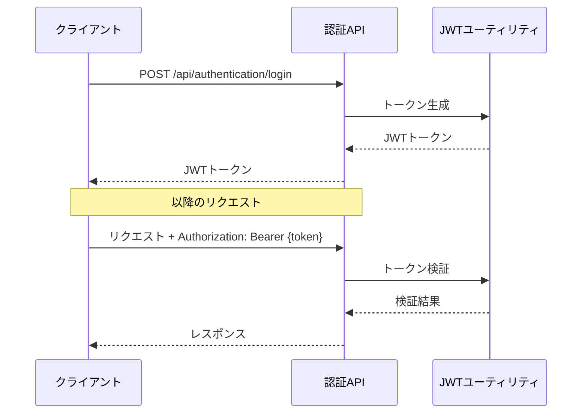
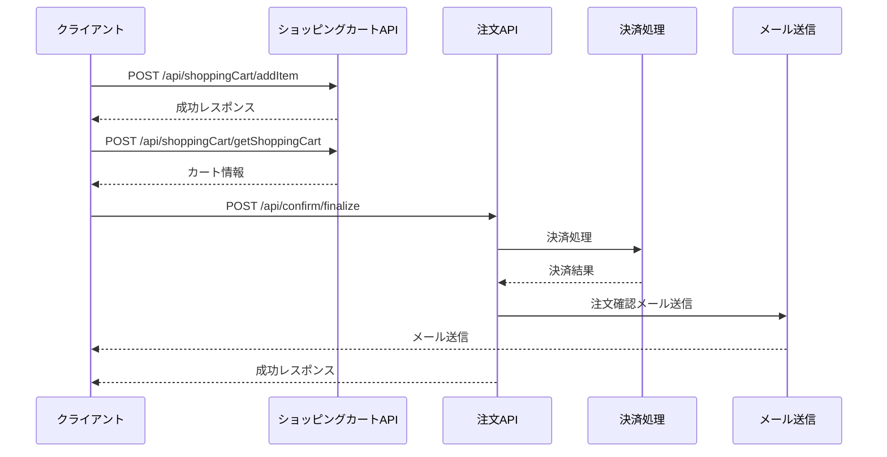

# API設計

## API一覧

| エンドポイント | メソッド | 説明 | 認証要否 |
|--------------|---------|------|---------|
| `/api/authentication/login` | POST | ユーザーログイン | 不要 |
| `/api/register` | POST | ユーザー登録 | 不要 |
| `/api/getUser` | GET | ユーザー情報取得 | 必要 |
| `/api/getItemList` | GET | 商品一覧取得 | 不要 |
| `/api/getItemList/search` | POST | 商品検索 | 不要 |
| `/api/getItemList/page` | POST | ページング付き商品一覧取得 | 不要 |
| `/showDetail` | GET | 商品詳細取得 | 不要 |
| `/api/shoppingCart/getShoppingCart` | POST | ショッピングカート取得 | 不要 |
| `/api/shoppingCart/addItem` | POST | ショッピングカートに商品追加 | 不要 |
| `/api/shoppingCart/deleteItem` | POST | ショッピングカートから商品削除 | 不要 |
| `/api/confirm/finalize` | POST | 注文確定 | 必要 |
| `/img/{name}` | GET | 画像取得 | 不要 |

## API詳細

### 認証API

#### ログイン

- **エンドポイント**: `/api/authentication/login`
- **メソッド**: POST
- **認証**: 不要
- **リクエスト**:
  ```json
  {
    "email": "string",
    "password": "string",
    "anonymous": "string" // 匿名ユーザーID（オプション）
  }
  ```
- **レスポンス**:
  - 成功時 (200 OK):
    ```json
    "JWT_TOKEN_STRING"
    ```
  - 失敗時 (401 Unauthorized):
    ```json
    "Invalid credentials"
    ```
- **説明**: ユーザー認証を行い、JWTトークンを返します。匿名ユーザーIDが指定された場合、そのカートの内容をログインユーザーのカートに移行します。

### ユーザー管理API

#### ユーザー登録

- **エンドポイント**: `/api/register`
- **メソッド**: POST
- **認証**: 不要
- **リクエスト**:
  ```json
  {
    "firstName": "string",
    "lastName": "string",
    "email": "string",
    "password": "string",
    "zipcode": "string",
    "prefecture": "string",
    "municipalities": "string",
    "address": "string",
    "telephone": "string"
  }
  ```
- **レスポンス**:
  - 成功時 (200 OK):
    ```json
    "User registered successfully"
    ```
  - 失敗時 (400 Bad Request):
    ```json
    [
      {
        "code": "string",
        "defaultMessage": "string",
        "field": "string",
        "objectName": "string",
        "rejectedValue": "object"
      }
    ]
    ```
- **説明**: 新規ユーザーを登録します。メールアドレスが既に登録されている場合はエラーを返します。

#### ユーザー情報取得

- **エンドポイント**: `/api/getUser`
- **メソッド**: GET
- **認証**: 必要
- **ヘッダー**: `Authorization: Bearer JWT_TOKEN`
- **レスポンス**:
  - 成功時 (200 OK):
    ```json
    {
      "id": "string",
      "firstName": "string",
      "lastName": "string",
      "email": "string",
      "zipcode": "string",
      "prefecture": "string",
      "municipalities": "string",
      "address": "string",
      "telephone": "string"
    }
    ```
  - 失敗時 (401 Unauthorized)
- **説明**: 認証済みユーザーの情報を取得します。

### 商品API

#### 商品一覧取得

- **エンドポイント**: `/api/getItemList`
- **メソッド**: GET
- **認証**: 不要
- **レスポンス**:
  - 成功時 (200 OK):
    ```json
    [
      {
        "id": "string",
        "description": "string",
        "price": 0,
        "image": "string",
        "gender": "string",
        "birthDay": "string",
        "deleted": false,
        "breed": {
          "id": "string",
          "name": "string"
        },
        "color": {
          "id": "string",
          "name": "string"
        }
      }
    ]
    ```
  - 失敗時 (400 Bad Request):
    ```json
    "エラーメッセージ"
    ```
- **説明**: すべての商品一覧を取得します。

#### 商品検索

- **エンドポイント**: `/api/getItemList/search`
- **メソッド**: POST
- **認証**: 不要
- **リクエスト**:
  ```json
  {
    "minPrice": "string",
    "maxPrice": "string",
    "breedId": "string",
    "colorList": ["string"]
  }
  ```
- **レスポンス**:
  - 成功時 (200 OK):
    ```json
    [
      {
        "id": "string",
        "description": "string",
        "price": 0,
        "image": "string",
        "gender": "string",
        "birthDay": "string",
        "deleted": false,
        "breed": {
          "id": "string",
          "name": "string"
        },
        "color": {
          "id": "string",
          "name": "string"
        }
      }
    ]
    ```
  - 失敗時 (400 Bad Request):
    ```json
    "エラーメッセージ"
    ```
- **説明**: 指定された条件で商品を検索します。

#### ページング付き商品一覧取得

- **エンドポイント**: `/api/getItemList/page`
- **メソッド**: POST
- **認証**: 不要
- **リクエスト**:
  ```json
  {
    "search": {
      "minPrice": "string",
      "maxPrice": "string",
      "breedId": "string",
      "colorList": ["string"]
    },
    "page": {
      "currentPage": 1,
      "perPage": 10
    }
  }
  ```
- **レスポンス**:
  - 成功時 (200 OK):
    ```json
    {
      "metadata": {
        "currentPage": 1,
        "perPage": 10,
        "lastPage": 5,
        "total": 50
      },
      "data": [
        {
          "id": "string",
          "description": "string",
          "price": 0,
          "image": "string",
          "gender": "string",
          "birthDay": "string",
          "deleted": false,
          "breed": {
            "id": "string",
            "name": "string"
          },
          "color": {
            "id": "string",
            "name": "string"
          }
        }
      ]
    }
    ```
  - 失敗時 (400 Bad Request):
    ```json
    "エラーメッセージ"
    ```
- **説明**: ページング機能付きで商品一覧を取得します。検索条件も指定可能です。

#### 商品詳細取得

- **エンドポイント**: `/showDetail`
- **メソッド**: GET
- **認証**: 不要
- **パラメータ**: `id=商品ID`
- **レスポンス**:
  - 成功時 (200 OK):
    ```json
    {
      "id": "string",
      "description": "string",
      "price": 0,
      "image": "string",
      "gender": "string",
      "birthDay": "string",
      "deleted": false,
      "breed": {
        "id": "string",
        "name": "string"
      },
      "color": {
        "id": "string",
        "name": "string"
      }
    }
    ```
  - 失敗時 (400 Bad Request):
    ```json
    "エラーメッセージ"
    ```
- **説明**: 指定されたIDの商品詳細を取得します。

### ショッピングカートAPI

#### ショッピングカート取得

- **エンドポイント**: `/api/shoppingCart/getShoppingCart`
- **メソッド**: POST
- **認証**: 不要
- **リクエスト**:
  ```json
  {
    "userId": "string"
  }
  ```
- **レスポンス**:
  - 成功時 (200 OK):
    ```json
    {
      "id": "string",
      "userId": "string",
      "status": "PENDING",
      "totalPrice": 0,
      "orderItems": [
        {
          "id": "string",
          "item": {
            "id": "string",
            "description": "string",
            "price": 0,
            "image": "string",
            "gender": "string",
            "birthDay": "string",
            "deleted": false,
            "breed": {
              "id": "string",
              "name": "string"
            },
            "color": {
              "id": "string",
              "name": "string"
            }
          },
          "options": [
            {
              "id": "string",
              "name": "string",
              "price": 0,
              "optionGroup": {
                "id": "string",
                "name": "string",
                "inputType": "string"
              }
            }
          ]
        }
      ]
    }
    ```
  - 失敗時 (400 Bad Request):
    ```json
    "エラーメッセージ"
    ```
- **説明**: 指定されたユーザーIDのショッピングカートを取得します。カートが存在しない場合は新規作成します。

#### ショッピングカートに商品追加

- **エンドポイント**: `/api/shoppingCart/addItem`
- **メソッド**: POST
- **認証**: 不要
- **リクエスト**:
  ```json
  {
    "userId": "string",
    "itemId": "string",
    "optionIds": ["string"]
  }
  ```
- **レスポンス**:
  - 成功時 (200 OK):
    ```json
    "success adding item"
    ```
  - 失敗時 (400 Bad Request):
    ```json
    "エラーメッセージ"
    ```
- **説明**: ショッピングカートに商品を追加します。オプションも指定可能です。

#### ショッピングカートから商品削除

- **エンドポイント**: `/api/shoppingCart/deleteItem`
- **メソッド**: POST
- **認証**: 不要
- **リクエスト**:
  ```json
  {
    "orderItemId": "string"
  }
  ```
- **レスポンス**:
  - 成功時 (200 OK):
    ```json
    "success deleting orderItem"
    ```
  - 失敗時 (400 Bad Request):
    ```json
    "エラーメッセージ"
    ```
- **説明**: ショッピングカートから指定された商品を削除します。

### 注文API

#### 注文確定

- **エンドポイント**: `/api/confirm/finalize`
- **メソッド**: POST
- **認証**: 必要
- **ヘッダー**: `Authorization: Bearer JWT_TOKEN`
- **リクエスト**:
  ```json
  {
    "form": {
      "orderId": "string",
      "userId": "string", // サーバー側で上書きされるため省略可能
      "destinationName": "string",
      "destinationEmail": "string",
      "destinationZipcode": "string",
      "destinationPrefecture": "string",
      "destinationMunicipalities": "string",
      "destinationAddress": "string",
      "destinationTel": "string",
      "deliveryDate": "string",
      "timeRange": "string",
      "paymentMethod": "string"
    },
    "paymentInfo": {
      "cardNumber": "string",
      "cardHolder": "string",
      "expiryDate": "string",
      "cvv": "string"
    }
  }
  ```
- **レスポンス**:
  - 成功時 (200 OK):
    ```json
    "success"
    ```
  - 失敗時 (400 Bad Request):
    ```json
    "エラーメッセージ"
    ```
- **説明**: 注文を確定し、支払い処理を行います。成功時には注文確認メールが送信されます。

### 画像API

#### 画像取得

- **エンドポイント**: `/img/{name}`
- **メソッド**: GET
- **認証**: 不要
- **パス変数**: `name` - 画像ファイル名
- **レスポンス**:
  - 成功時 (200 OK): 画像データ (JPEG)
  - 失敗時 (404 Not Found)
- **説明**: 指定された名前の画像ファイルを取得します。

## 認証フロー



## 注文処理フロー



## セキュリティ

- JWT (JSON Web Token) を使用した認証
- Spring Securityによる認可制御
- パスワードはBCryptでハッシュ化して保存
- CSRF対策
- XSS対策
