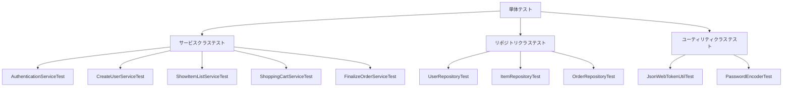
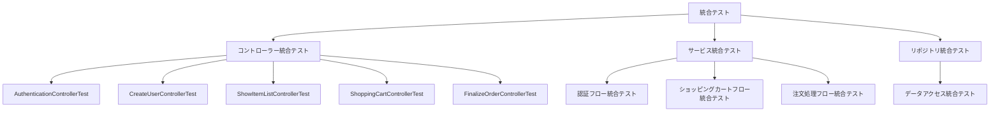
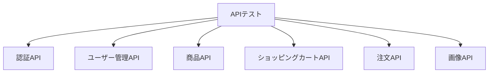
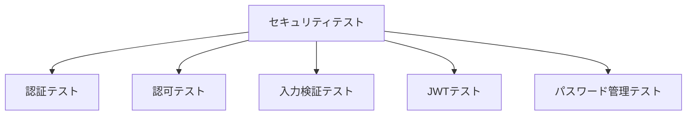
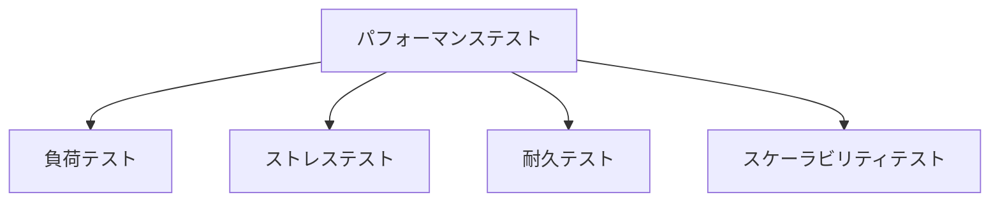
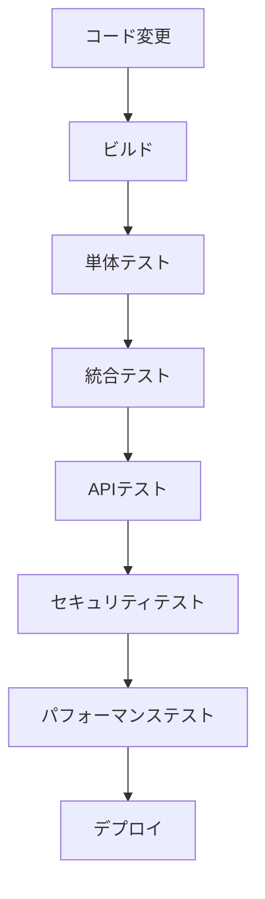

# テスト計画

## テスト戦略

このプロジェクトでは、以下のテスト戦略を採用します。

1. **単体テスト**: 個々のコンポーネントの機能を検証
2. **統合テスト**: コンポーネント間の連携を検証
3. **API テスト**: RESTful API の動作を検証
4. **セキュリティテスト**: セキュリティ要件の充足を検証
5. **パフォーマンステスト**: システムのパフォーマンスを検証

## テスト環境

### 開発環境
- JDK 17
- Spring Boot 3.3.0
- PostgreSQL（開発用データベース）
- JUnit 5
- Mockito
- Spring Test

### テスト環境
- 開発環境と同等の構成
- テスト用データベース（開発用と分離）

### ステージング環境
- 本番環境と同等の構成
- テストデータを含むデータベース

## テスト種別

### 単体テスト



#### サービスクラステスト

| テスト対象 | テスト項目 | 期待結果 |
|----------|----------|---------|
| AuthenticationService | ログイン成功 | JWTトークンが返却される |
| AuthenticationService | ログイン失敗（不正なメールアドレス） | nullが返却される |
| AuthenticationService | ログイン失敗（不正なパスワード） | nullが返却される |
| CreateUserService | ユーザー登録成功 | ユーザーがデータベースに保存される |
| CreateUserService | ユーザー登録失敗（メールアドレス重複） | 例外がスローされる |
| ShowItemListService | 全商品取得 | 全商品のリストが返却される |
| ShowItemListService | 条件付き商品検索 | 条件に合致する商品のリストが返却される |
| ShoppingCartService | カート作成 | 新規カートが作成される |
| ShoppingCartService | 商品追加 | カートに商品が追加される |
| ShoppingCartService | 商品削除 | カートから商品が削除される |
| FinalizeOrderService | 注文確定 | 注文が確定され、メールが送信される |

#### リポジトリクラステスト

| テスト対象 | テスト項目 | 期待結果 |
|----------|----------|---------|
| UserRepository | メールアドレスによるユーザー検索 | 該当ユーザーが返却される |
| UserRepository | 存在しないメールアドレスによる検索 | nullが返却される |
| ItemRepository | 全商品取得 | 全商品のリストが返却される |
| ItemRepository | 価格範囲による商品検索 | 価格範囲内の商品が返却される |
| ItemRepository | 犬種による商品検索 | 指定された犬種の商品が返却される |
| OrderRepository | ユーザーIDとステータスによる注文検索 | 該当する注文が返却される |

#### ユーティリティクラステスト

| テスト対象 | テスト項目 | 期待結果 |
|----------|----------|---------|
| JsonWebTokenUtil | トークン生成 | 有効なJWTトークンが生成される |
| JsonWebTokenUtil | トークン検証（有効） | trueが返却される |
| JsonWebTokenUtil | トークン検証（無効） | falseが返却される |
| JsonWebTokenUtil | トークン検証（期限切れ） | falseが返却される |
| PasswordEncoder | パスワードエンコード | ハッシュ化されたパスワードが生成される |
| PasswordEncoder | パスワード照合（一致） | trueが返却される |
| PasswordEncoder | パスワード照合（不一致） | falseが返却される |

### 統合テスト



#### コントローラー統合テスト

| テスト対象 | テスト項目 | 期待結果 |
|----------|----------|---------|
| AuthenticationController | ログインAPI呼び出し（成功） | 200 OK, JWTトークン |
| AuthenticationController | ログインAPI呼び出し（失敗） | 401 Unauthorized |
| CreateUserController | ユーザー登録API呼び出し（成功） | 200 OK |
| CreateUserController | ユーザー登録API呼び出し（失敗） | 400 Bad Request |
| ShowItemListController | 商品一覧取得API呼び出し | 200 OK, 商品リスト |
| ShowItemListController | 商品検索API呼び出し | 200 OK, 検索結果 |
| ShoppingCartController | カート取得API呼び出し | 200 OK, カート情報 |
| ShoppingCartController | 商品追加API呼び出し | 200 OK |
| ShoppingCartController | 商品削除API呼び出し | 200 OK |
| FinalizeOrderController | 注文確定API呼び出し（認証あり） | 200 OK |
| FinalizeOrderController | 注文確定API呼び出し（認証なし） | 401 Unauthorized |

#### サービス統合テスト

| テスト対象 | テスト項目 | 期待結果 |
|----------|----------|---------|
| 認証フロー | ユーザー登録→ログイン | 登録成功、ログイン成功 |
| ショッピングカートフロー | カート作成→商品追加→商品削除 | 各操作が成功する |
| 注文処理フロー | カート作成→商品追加→注文確定 | 注文が確定され、メールが送信される |

#### リポジトリ統合テスト

| テスト対象 | テスト項目 | 期待結果 |
|----------|----------|---------|
| データアクセス | 複雑なクエリの実行 | 期待通りのデータが取得される |
| データアクセス | トランザクション処理 | トランザクションが正常に処理される |

### APIテスト



#### 認証API

| テスト対象 | テスト項目 | 期待結果 |
|----------|----------|---------|
| /api/authentication/login | 有効な認証情報でログイン | 200 OK, JWTトークン |
| /api/authentication/login | 無効なメールアドレスでログイン | 401 Unauthorized |
| /api/authentication/login | 無効なパスワードでログイン | 401 Unauthorized |
| /api/authentication/login | 匿名ユーザーIDを指定してログイン | 200 OK, カートが移行される |

#### ユーザー管理API

| テスト対象 | テスト項目 | 期待結果 |
|----------|----------|---------|
| /api/register | 有効なユーザー情報で登録 | 200 OK |
| /api/register | 既存のメールアドレスで登録 | 400 Bad Request |
| /api/register | 不正な形式のメールアドレスで登録 | 400 Bad Request |
| /api/getUser | 認証ありでユーザー情報取得 | 200 OK, ユーザー情報 |
| /api/getUser | 認証なしでユーザー情報取得 | 401 Unauthorized |

#### 商品API

| テスト対象 | テスト項目 | 期待結果 |
|----------|----------|---------|
| /api/getItemList | 商品一覧取得 | 200 OK, 商品リスト |
| /api/getItemList/search | 価格範囲で検索 | 200 OK, 検索結果 |
| /api/getItemList/search | 犬種で検索 | 200 OK, 検索結果 |
| /api/getItemList/search | 色で検索 | 200 OK, 検索結果 |
| /api/getItemList/search | 複合条件で検索 | 200 OK, 検索結果 |
| /api/getItemList/page | ページング付き商品一覧取得 | 200 OK, ページング情報付き商品リスト |
| /showDetail | 有効なIDで商品詳細取得 | 200 OK, 商品詳細 |
| /showDetail | 無効なIDで商品詳細取得 | 400 Bad Request |

#### ショッピングカートAPI

| テスト対象 | テスト項目 | 期待結果 |
|----------|----------|---------|
| /api/shoppingCart/getShoppingCart | 既存ユーザーのカート取得 | 200 OK, カート情報 |
| /api/shoppingCart/getShoppingCart | 新規ユーザーのカート取得 | 200 OK, 新規カート |
| /api/shoppingCart/addItem | 商品追加 | 200 OK |
| /api/shoppingCart/addItem | オプション付き商品追加 | 200 OK |
| /api/shoppingCart/deleteItem | 商品削除 | 200 OK |
| /api/shoppingCart/deleteItem | 存在しない商品削除 | 400 Bad Request |

#### 注文API

| テスト対象 | テスト項目 | 期待結果 |
|----------|----------|---------|
| /api/confirm/finalize | 認証ありで注文確定 | 200 OK |
| /api/confirm/finalize | 認証なしで注文確定 | 401 Unauthorized |
| /api/confirm/finalize | 無効な支払い情報で注文確定 | 400 Bad Request |
| /api/confirm/finalize | 無効な配送情報で注文確定 | 400 Bad Request |

#### 画像API

| テスト対象 | テスト項目 | 期待結果 |
|----------|----------|---------|
| /img/{name} | 存在する画像の取得 | 200 OK, 画像データ |
| /img/{name} | 存在しない画像の取得 | 404 Not Found |

### セキュリティテスト



#### 認証テスト

| テスト対象 | テスト項目 | 期待結果 |
|----------|----------|---------|
| 認証機能 | 有効な認証情報でログイン | 認証成功 |
| 認証機能 | 無効な認証情報でログイン | 認証失敗 |
| 認証機能 | 認証なしで保護されたリソースにアクセス | アクセス拒否 |

#### 認可テスト

| テスト対象 | テスト項目 | 期待結果 |
|----------|----------|---------|
| 認可機能 | 認証済みユーザーが自分のリソースにアクセス | アクセス許可 |
| 認可機能 | 認証済みユーザーが他人のリソースにアクセス | アクセス拒否 |

#### 入力検証テスト

| テスト対象 | テスト項目 | 期待結果 |
|----------|----------|---------|
| 入力検証 | SQLインジェクション攻撃 | 攻撃が防止される |
| 入力検証 | XSS攻撃 | 攻撃が防止される |
| 入力検証 | 不正な入力値 | バリデーションエラー |

#### JWTテスト

| テスト対象 | テスト項目 | 期待結果 |
|----------|----------|---------|
| JWT | 有効なトークンでアクセス | アクセス許可 |
| JWT | 無効なトークンでアクセス | アクセス拒否 |
| JWT | 期限切れトークンでアクセス | アクセス拒否 |
| JWT | 改ざんされたトークンでアクセス | アクセス拒否 |

#### パスワード管理テスト

| テスト対象 | テスト項目 | 期待結果 |
|----------|----------|---------|
| パスワード管理 | パスワードのハッシュ化 | パスワードがハッシュ化されて保存される |
| パスワード管理 | パスワード照合 | 正しいパスワードのみ照合成功 |

### パフォーマンステスト



#### 負荷テスト

| テスト対象 | テスト項目 | 期待結果 |
|----------|----------|---------|
| 商品一覧API | 同時100ユーザーアクセス | レスポンスタイム < 1秒 |
| 商品検索API | 同時50ユーザーアクセス | レスポンスタイム < 1秒 |
| ショッピングカートAPI | 同時30ユーザーアクセス | レスポンスタイム < 1秒 |
| 注文確定API | 同時10ユーザーアクセス | レスポンスタイム < 2秒 |

#### ストレステスト

| テスト対象 | テスト項目 | 期待結果 |
|----------|----------|---------|
| システム全体 | 通常の2倍の負荷 | システムが正常に動作する |
| システム全体 | 通常の5倍の負荷 | エラー率 < 1% |

#### 耐久テスト

| テスト対象 | テスト項目 | 期待結果 |
|----------|----------|---------|
| システム全体 | 24時間連続稼働 | システムが正常に動作する |
| システム全体 | 1週間連続稼働 | メモリリークなし |

#### スケーラビリティテスト

| テスト対象 | テスト項目 | 期待結果 |
|----------|----------|---------|
| システム全体 | インスタンス数を増やした場合 | 性能が線形に向上する |
| データベース | データ量を増やした場合 | 性能劣化が最小限に抑えられる |

## テスト自動化

### 自動化対象

- 単体テスト: JUnit 5 + Mockito
- 統合テスト: Spring Test
- APIテスト: REST Assured
- セキュリティテスト: OWASP ZAP（一部）
- パフォーマンステスト: JMeter

### CI/CD パイプライン



## テスト実施計画

### フェーズ1: 単体テスト

- 期間: 1週間
- 担当: 開発者
- 成果物: テスト結果レポート

### フェーズ2: 統合テスト

- 期間: 1週間
- 担当: 開発者
- 成果物: テスト結果レポート

### フェーズ3: APIテスト

- 期間: 1週間
- 担当: QAエンジニア
- 成果物: テスト結果レポート

### フェーズ4: セキュリティテスト

- 期間: 1週間
- 担当: セキュリティエンジニア
- 成果物: セキュリティ評価レポート

### フェーズ5: パフォーマンステスト

- 期間: 1週間
- 担当: パフォーマンスエンジニア
- 成果物: パフォーマンス評価レポート

## テスト環境構築

### 開発環境

```bash
# PostgreSQLのセットアップ
docker run --name postgres-dev -e POSTGRES_PASSWORD=postgres -e POSTGRES_DB=ecsite-ddd-go -p 5432:5432 -d postgres

# アプリケーションのビルド
./gradlew clean build

# テストの実行
./gradlew test
```

### テスト環境

```bash
# テスト用データベースのセットアップ
docker run --name postgres-test -e POSTGRES_PASSWORD=postgres -e POSTGRES_DB=ecsite-ddd-go-test -p 5433:5432 -d postgres

# テスト用アプリケーションの起動
java -jar -Dspring.profiles.active=test build/libs/ecsite-ddd-go-0.0.1-SNAPSHOT.jar
```

## テストデータ管理

### テストデータ作成

- 初期データ: schema-postgresql.sql
- テストデータ: data.sql（テスト用）

### データベースリセット

```bash
# テストデータベースのリセット
docker exec -it postgres-test psql -U postgres -d ecsite-ddd-go-test -c "DROP SCHEMA public CASCADE; CREATE SCHEMA public;"
docker exec -it postgres-test psql -U postgres -d ecsite-ddd-go-test -f /docker-entrypoint-initdb.d/schema-postgresql.sql
docker exec -it postgres-test psql -U postgres -d ecsite-ddd-go-test -f /docker-entrypoint-initdb.d/data.sql
```

## テスト結果管理

### テスト結果の記録

- JUnit: build/reports/tests/test/index.html
- JaCoCo: build/reports/jacoco/test/html/index.html
- REST Assured: build/reports/rest-assured/index.html
- JMeter: build/reports/jmeter/index.html

### テストカバレッジ目標

- 単体テスト: 80%以上
- 統合テスト: 70%以上
- APIテスト: 90%以上

## 障害管理

### 障害報告

- 障害ID
- 障害概要
- 再現手順
- 期待結果
- 実際の結果
- 重要度
- 優先度
- ステータス
- 担当者

### 障害追跡

- 未解決
- 解決中
- 解決済み
- 検証済み
- クローズ
