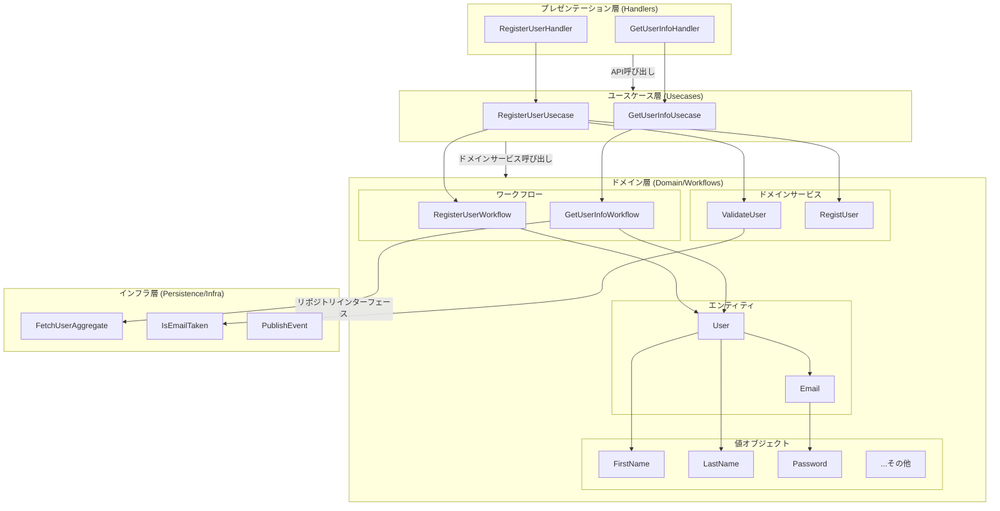
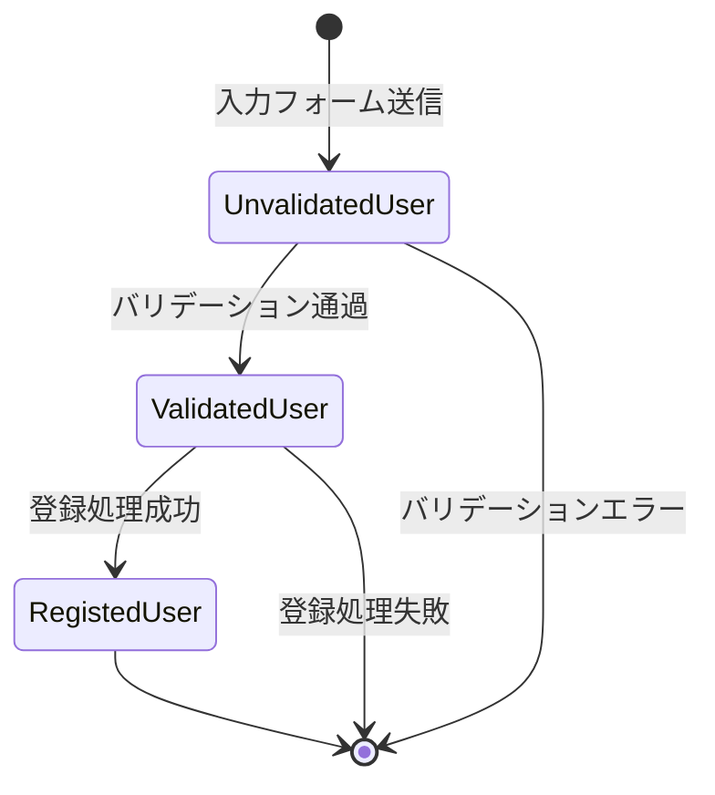
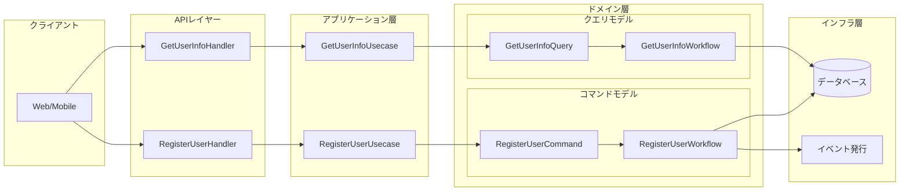
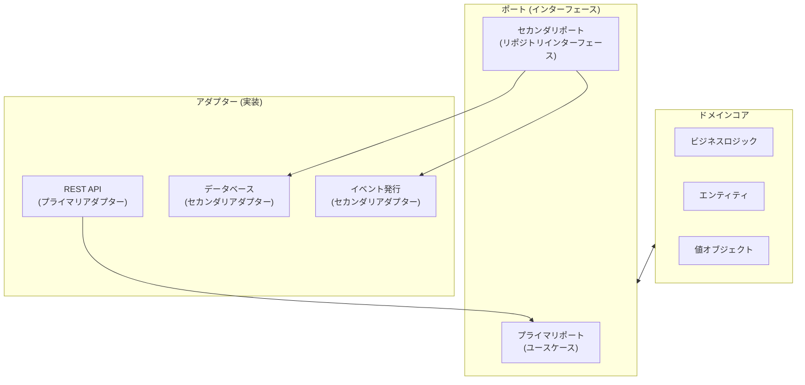
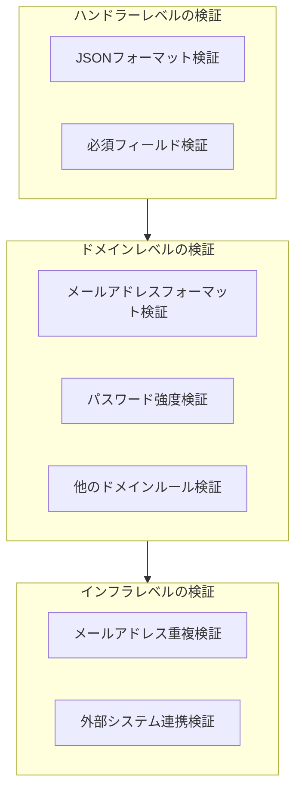

# DDDアプローチを採用したGoプロジェクトのアーキテクチャ評価

## 1. 概要

このプロジェクトは、ECサイト向けのバックエンドAPIをGo言語で実装したものであり、ドメイン駆動設計（DDD）の原則に基づいて構築されています。主な特徴として以下が挙げられます：

- 明確に区分された階層構造
- ヘキサゴナルアーキテクチャ（ポートとアダプター）の採用
- 豊富なドメインモデルと型によるドメイン制約の表現
- CQRSパターン（Command Query Responsibility Segregation）の実装
- イベント駆動型アーキテクチャの要素

## 2. アーキテクチャ図



## 3. アーキテクチャの特徴分析

### 3.1 階層構造

このプロジェクトは、以下の4つの主要な階層に分かれています：

- **プレゼンテーション層（Handlers）**: HTTPリクエストを処理し、適切なユースケースを呼び出します
- **ユースケース層（Usecases）**: アプリケーションのビジネスロジックを実装し、ドメイン層のサービスを調整します
- **ドメイン層（Domain）**: ビジネスルールと概念をエンティティ、値オブジェクト、ドメインサービスとして表現します
- **インフラ層（Persistence/Infra）**: 永続化、イベント発行、外部サービスとのインタラクションを担当します

### 3.2 ドメインモデルの設計

ドメインモデルは非常に豊かで、ビジネスルールが型システムに組み込まれています：

- **集約ルート**: `User`エンティティが集約ルートとして機能
- **値オブジェクト**: `FirstName`, `LastName`, `Email`, `Password`などが値オブジェクトとして実装
- **ドメインサービス**: `ValidateUser`, `RegistUser`などが特定のドメイン操作を実装
- **ドメインイベント**: `UserRegistered`などのイベントがドメイン変更を表現

### 3.3 状態遷移とライフサイクル管理

ユーザー登録プロセスでは、明確な状態遷移モデルが採用されています：



各状態は固有の検証ルールと制約を持ち、ドメインの完全性を保証します：

- **UnvalidatedUser**: 生の入力データを表現 (ユーザー入力そのまま)
- **SelfValidatedUser**: 基本的なフォーマット検証を通過したデータ
- **ValidatedUser**: ビジネスルール（例：メールアドレスの重複チェック）を満たすデータ
- **RegistedUser**: システムに登録された最終的なユーザーデータ

### 3.4 CQRSパターン

このプロジェクトはCQRSパターンを実装しており、読み取り操作と書き込み操作が明確に分離されています：



これにより、読み取りと書き込みの各操作に最適化されたモデルを使用することができ、スケーラビリティと保守性が向上します。

### 3.5 ヘキサゴナルアーキテクチャの適用

プロジェクトはヘキサゴナルアーキテクチャ（ポートとアダプター）の原則に従っています：



この設計により、ドメインロジックが外部の関心事（データベース、API、UI）から分離され、テスト容易性と柔軟性が向上しています。

## 4. 具体的な実装詳細

### 4.1 関数型パターンの活用

このプロジェクトでは、関数型プログラミングのパターンが多用されています：

```go
// ユーザー検証のワークフロー定義
type ValidateUser func(user userdomain.UnvalidatedUser) (*userdomain.ValidatedUser, error)

// ユーザー登録のワークフロー定義
type RegisterUserWorkflow func(user userdomain.UnvalidatedUser) ([]RegisterUserEvent, error)

// ワークフロー合成
usecase := userusecases.NewRegisterUserUsecase(taken, func(vu userworkflows.ValidateUser, ru userworkflows.RegistUser) userworkflows.RegisterUserWorkflow {
    return func(user userdomain.UnvalidatedUser) ([]userworkflows.RegisterUserEvent, error) {
        // ワークフローの実装
    }
})
```

この関数型アプローチにより、コンポーネントの合成と再利用が容易になり、テスト容易性も向上しています。

### 4.2 型安全性の確保

Go言語の型システムを活用し、ドメイン知識をコードレベルで表現しています：

```go
// 型による制約を表現
type FirstName string
type LastName string
type Email struct{ UniqueEmail }
type FormattedEmail struct{ string }
type UniqueEmail struct{ FormattedEmail }
```

これらの型定義により、単なる文字列ではなく、特定のドメイン概念としての値を扱うことができ、コンパイル時に型安全性が確保されます。

### 4.3 検証ロジックの階層化

バリデーションロジックが階層化されており、各レベルで特定の検証に焦点を当てています：



この階層化により、各レベルでの関心事が分離され、コードの保守性が向上しています。

### 4.4 イベント駆動アーキテクチャ

システムはイベント駆動設計を採用しており、ドメインイベントを通じて副作用を分離しています：

```go
type RegisterUserEvent interface {
    registerUserEvent()
    IsEvent()
}

// ユーザー登録イベント
type UserRegistered struct {
    RegistedUser userdomain.RegistedUser
}

// イベントの発行
for _, event := range events {
    shareinfra.PublishEvent(event)
}
```

この設計により、ユーザー登録後の追加処理（メール送信、統計更新など）を柔軟に追加できます。

### 4.5 共有カーネル

プロジェクトでは、複数のコンテキスト間で共有される概念が `share` パッケージとして実装されています：

- **共通型**: `Command`, `Query`, `AuditInfo` など
- **共通インターフェース**: `Event`, `Workflow` など
- **共通ユーティリティ**: `ValidationErrors` など

これにより、異なるドメイン間で一貫した抽象化が保証されています。

## 5. アーキテクチャの評価

### 5.1 長所

#### 5.1.1 ドメインの表現力

型システムを用いてドメイン概念を明示的に表現しており、ドメインの意図が明確に伝わります。例えば、単なる `string` ではなく `FirstName` や `Password` といった型を使用することで、それぞれの値が持つドメイン上の役割と制約が明確になっています。

#### 5.1.2 関心事の分離

各レイヤーが明確に分離されており、それぞれが特定の責務に集中しています。これにより変更の影響範囲が限定され、コードの保守性が向上します。特にドメインロジックがインフラストラクチャの詳細から完全に分離されている点は評価できます。

#### 5.1.3 テスト容易性

関数型アプローチと依存性の明示的な注入により、単体テストが容易になっています。特にドメインロジックは外部依存なしでテスト可能で、モックやスタブを簡単に使用できる設計になっています。

#### 5.1.4 拡張性

新しいユースケースやドメイン操作を追加する際の設計パターンが確立されているため、一貫した方法で機能を拡張できます。また、イベント駆動設計により、新しい副作用を既存コードを変更せずに追加できます。

### 5.2 改善点

#### 5.2.1 ボイラープレートコード

型安全性と明示的な境界の代償として、多くのボイラープレートコードが必要になっています。特に小規模な機能では、このオーバーヘッドが過剰に感じられる場合があります。

```go
// コマンドの変換処理など、冗長に感じられる部分
func (h RegisterUserHandler) req2command(r *http.Request) (*sharetypes.Command[usertypes.RegisterUserCommand], error) {
    var command usertypes.RegisterUserCommand
    if err := json.NewDecoder(r.Body).Decode(&command); err != nil {
        return nil, err
    }
    if err := h.validate(command); err != nil {
        return nil, err
    }
    return &sharetypes.Command[usertypes.RegisterUserCommand]{
        Context:    r.Context(),
        Timestamp:  time.Now(),
        IdentityID: nil,
        Data:       command,
    }, nil
}
```

#### 5.2.2 複雑な型階層

型の階層が深く、継承関係が複雑な箇所があります。特にメールアドレス関連の型階層（`Email`, `UniqueEmail`, `FormattedEmail`）は、理解と追跡が難しくなっています。

```go
// メールアドレスの型階層
type Email struct{ UniqueEmail }
type FormattedEmail struct{ string }
type UniqueEmail struct{ FormattedEmail }
```

#### 5.2.3 エラーハンドリングの一貫性

エラーハンドリングの方法が一部不統一です。例えば、一部では独自の `ValidationErrors` 型を使用し、他の箇所では標準の `error` インターフェースを使用しています。より一貫したエラーモデルの採用が望ましいでしょう。

#### 5.2.4 永続化層の実装

現在の実装ではモック版の永続化層しか実装されていません（`TODO` コメントが残っている）。実際のデータベースとの連携部分を実装する際には、トランザクション管理やエラーハンドリングなどの追加の複雑さが発生します。

```go
func NewIsEmailTaken(ctx context.Context) userdomain.IsEmailTaken {
    return func(email userdomain.FormattedEmail) (bool, error) {
        // TODO(char5742): メールアドレスの重複チェックを実装
        return false, nil
    }
}
```

## 6. 改善提案

### 6.1 コードジェネレーターの導入

ボイラープレートコードを削減するためのコードジェネレーターを導入することを検討してください。特にCRUD操作や標準的なバリデーションなど、パターン化された部分の自動生成が役立ちます。

### 6.2 型構造の簡素化

型の階層関係を見直し、より直感的で単純な構造を目指すことを推奨します。例えば、深い継承関係の代わりに、メソッドによる検証と変換を活用する方法も検討できます：

```go
// 改善例
type Email string

func (e Email) IsValidFormat() bool {
    // フォーマット検証ロジック
    return true
}

func (e Email) IsUnique(checker UniqueChecker) (bool, error) {
    // 一意性検証ロジック
    return checker.IsUnique(string(e))
}
```

### 6.3 エラーハンドリング戦略の統一

プロジェクト全体で一貫したエラーハンドリング戦略を採用してください。例えば、エラーコードとメッセージを含む標準化されたエラー構造体を定義し、それをすべてのレイヤーで使用することが考えられます。

### 6.4 テストカバレッジの向上

アーキテクチャがテスト容易性を高めていることを活かし、包括的なテストスイートの開発を推奨します。特に以下のテストに注力することで、設計の堅牢性が確保されます：

- ドメインロジックの単体テスト
- ユースケースの統合テスト
- 境界を越えるインタラクションのテスト（例：永続化層とドメイン層の連携）

### 6.5 ドキュメントの拡充

アーキテクチャの複雑さを考慮すると、より詳細な技術ドキュメントが必要です。特に以下の点についてのドキュメント化を推奨します：

- アーキテクチャの原則と設計判断
- 新機能追加時のガイドライン
- 主要なドメイン概念とその関係
- 一般的なユースケースの実装パターン

## 7. 結論

このプロジェクトは、ドメイン駆動設計の原則を忠実に実装した優れた例です。複雑なドメインロジックを型安全で保守性の高い方法で表現することに成功しています。いくつかの改善点はあるものの、基本的なアーキテクチャは堅牢で、拡張性に優れています。

特に評価すべき点は、関数型アプローチとドメインモデルの豊かな表現力です。これにより、ビジネスロジックがコードに直接反映され、開発者が技術的な詳細よりもドメインに集中できる環境が整っています。

改善提案を適用することで、より保守性が高く、理解しやすいコードベースになるでしょう。また、アーキテクチャのドキュメント化を進めることで、チームの知識共有とオンボーディングが容易になります。